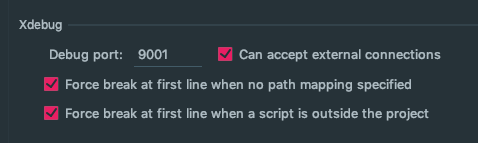
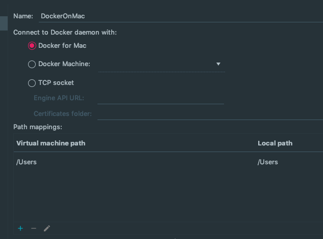
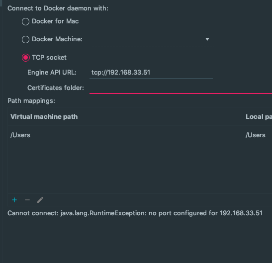

## Docker on Vagrant をがんばってみた

### なぜ Docker on Vagrant?

おとなしく **Docker for Mac** 使えばいいんじゃない？\
そうなんです。その通りなんです。 **Docker** 自体 **Vagrant**
を挟んで使う想定でつくられてないし。\
でも、ただただ **遅い** んです。

ページのリロードに数秒〜十数秒かかるんです。\
解決策として **docker-sync** なるものもあるけどさほど変化なしだし、.git だの node_modules を除外するなど[めんどくさい]{.under_line}。

とてもじゃないけど開発環境とは言えないんです。(当環境では）\
ストレスだし思考は止まるしイライラするし。

とはいえ、 **Docker** を使わないというわけにはいかない。\
なのでオレオレ **Docker on Vagrant**で IDEA(PhpStorm など)でリモートデバッグ、phpunit 実行(IDEA 使用)までをやってみた。

結果 : 今の所やってよかった。

- **Docker on Vagrant** 用の **Vagrant** を用意
- テストして **Docker** 上に Laravel を設置
- xdebug をインストールして リモートデバッグ
- **Vagrant** 越しで phpunit を実行 (ココで詰まった、救世主がいた！)

#### Docker on Vagrant を用意

[//]: # (手前味噌の記事 汎用的な Vagrant&#40; CentOS7 &#41;&#40;https://blog.webdimension.jp/linux/vagrant-template-centos7/&#41;)

[//]: # (の[Source]&#40;https://github.com/WEBDIMENSION/vagrant-centos7&#41;を元に **provisioning** の際に **Docker**
インストールを追記しました。\)

[//]: # ([Source]&#40;https://github.com/WEBDIMENSION/docker-on-vagrant&#41;)

追記分 ( CircleCI はお好みで )

```bash
## Docker sudo yum remove -y docker docker-common docker-selinux
##  Docker
sudo yum remove -y docker docker-common docker-selinux docker-engine
sudo yum install -y yum-utils device-mapper-persistent-data lvm2
sudo yum-config-manager --add-repo https://download.docker.com/linux/centos/docker-ce.repo
sudo yum makecache fast
# sudo yum list docker-ce.x86_64 --showduplicates | sort -r
sudo yum remove -y docker-ce
sudo yum install -y docker-ce
sudo systemctl start docker
sudo systemctl enable docker
sudo groupadd docker
sudo usermod -aG docker $USER

## docker-composer
 FILE="/usr/local/bin/docker-compose"
   if [ -e ${FILE} ]; then
     sudo rm  ${FILE} /usr/bin/docker-compose
   fi
sudo curl -L "https://github.com/docker/compose/releases/download/1.24.1/docker-compose-$(uname -s)-$(uname -m)" -o ${FILE}
sudo chmod +x ${FILE}
sudo ln -s ${FILE} /usr/bin/docker-compose

# circleci-local
 FILE="/usr/local/bin/circleci"
   if [ -e ${FILE} ]; then
     sudo rm  ${FILE}
   fi
sudo curl -o /usr/local/bin/circleci https://circle-downloads.s3.amazonaws.com/releases/build_agent_wrapper/circleci && sudo chmod +x /usr/local/bin/circleci
```

#### テストして Docker 上に Laravel を設置テストして Docker に Laravel を設置

ここでは Docker の設定等は省きます。\
**ハマりポイント**\
MySQL や Redis のデータディレクトリをマウントした際(永続化)にパーミッションエラーがでる。 ホスト側から

```bash
$ chmod 777 data_dir
```

などでなんとか逃げる。(最初の一度だけで大丈夫)

#### xdebug をインストールして リモートデバッグ

php ビルド時に xdebug をインストール\
Dockerfile に追記

```bash
# xdebug
RUN pecl install xdebug \
  && docker-php-ext-enable xdebug
```

xdebug 用 php.ini (port:9001 に設定)

```bash
[xdebug]
xdebug.remote_enable=1
xdebug.remote_autostart=1
xdebug.remote_connect_back = 1
xdebug.remote_port=9001
xdebug.remote_log=/tmp/xdebug.log
xdebug.idekey="xdebug"
```

IDEA 設定\
Preferences \| Languages & Frameworks \| PHP \| Debug

**xdebug の port を 9001 に変更**



IDEA 設定\
Preferences \| Languages & Frameworks \| PHP \| Debug \| DBGp Proxy

**port**を 9001 に変更\
IDE key は php.ini 上の xdebug.idekey\
Host は Laravel へのドメインや IP


IDEA 設定\
Preferences \| Languages & Frameworks \| PHP \| Servers

name : 自由な名前\
Host:プロジェクトのドメイン or IP\
Use path mappings チェックする。 ローカルのパスとサーバー上のパスを合わせる


IDEA 設定\
phpdebug を ON


適当にブレークポイントを設定 (例えば index.php のどこか)\
ブラウザで TopPage などを表示\
設定に間違いがなければブレークポイントで止まるでしょう。

## Vagrant 越しで phpunit を実行

**ここでハマった・・・**\
IDEA に Docker プラグイン導入は必須です。\
IDEA から **phpunit** を実行するには **phpcli intepriter** の設定が必要です。

IDEA 設定\
Preferences \| Build, Execution, Deployment \| Docker\
で Docker との接続を設定するのですが今回は **Docker for Mac** でもないし
**Docier Machine** でもない。 気になるのは **TCP Socket**



"Docker tcp socket" で検索するとどうやら **2376**
の Port を使うらしい。ということで **TCP Socket** に .\
Vagrant の ip:2376 （例 192.168.33.11:2376 ）\
で接続を試みるも繋がらず・・・\
画像はわざとエラーを出すために IP を変えてます。



そんな諦めかけた時に救世主現る！\
[PyCharm の Project Interpreter に remote docker の Python を使う PyCharm の Project Interpreter に remote docker の Python を使う](https://qiita.com/wwacky/items/49d1a6239cd24bd12e71https://qiita.com/wwacky/items/49d1a6239cd24bd12e71)\
Python 記事ですがやりたいことはまさにこれでした。 ここの記事を実施。

Vagrant 上にて

```bash
$ sudo mkdir /etc/systemd/system/docker.service.d/
$ sudo vim /etc/systemd/system/docker.service.d/startup_options.conf
```

以下を記述

```bash
[Service]
ExecStart=
ExecStart=/usr/bin/dockerd -H unix:// -H tcp://0.0.0.0:2376
```

```bash
# systemd  restart
$ sudo systemctl daemon-reload
$ sudo systemctl restart docker.service
```

```bash
$ service docker status
# "/usr/bin/dockerd -H unix:// -H tcp://0.0.0.0:2376" の表示があれば成功
```

Nmap で確認してみる

```bash
nmap 192.168.33.50 -p 2376

PORT     STATE SERVICE
2376/tcp open  docker
```

Open、オープン、**おーーーぷん!** (手応えあり 喜)\
さっきまでは **filtered** だった。再接続を試みる。


Success, サクセス、 **さーーーくせす** (勝利の予感 わくわくしてくる)\
次に **intepriter** を設定します。\
IDEA 設定\
Preferences \| Languages & Frameworks \| PHP


間違いがなければ php のバージョン、xdebug のバージョンが表示されます。 IDEA 設定\
Preferences \| Languages & Frameworks \| PHP \| Test Frameworks\
Test Frameworks に **intepriter** を登録します。\
Container path は Docker 側、Host path はこの場合 Host 側ではなく Vagrant 上の path です。\
Docker 側のマウントと同様に docker container: の項目で設定します。 通常は /home/vagrant/xxxxxx というような path になります。 Laravel の autoloader は
Laravel/vendor/autoload.php になります。 phpunit.xml は Laravel/phpunit.xml になります。


メニューから Run -\> Edit configureations と進み + をクリック phpunit を登録


unittest を実行してみる。


なんとか unittest が通りました。

これで **Docker on Vagrant** でもいつもと同じように作業ができます。\
また、付加価値として Mac 側を汚さないというのもありますね。(Image はすべて Vagrant 内)\
なによりもレスポンスに満足です。
**Vagrant** 上に LAMP 環境作って作業するのと体感的にはかわりません。\
今のところ大満足。。。
