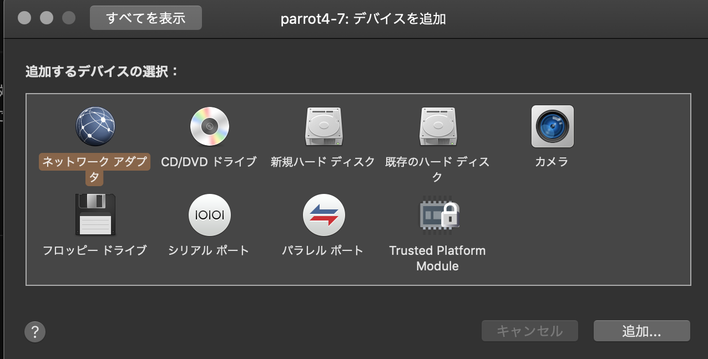
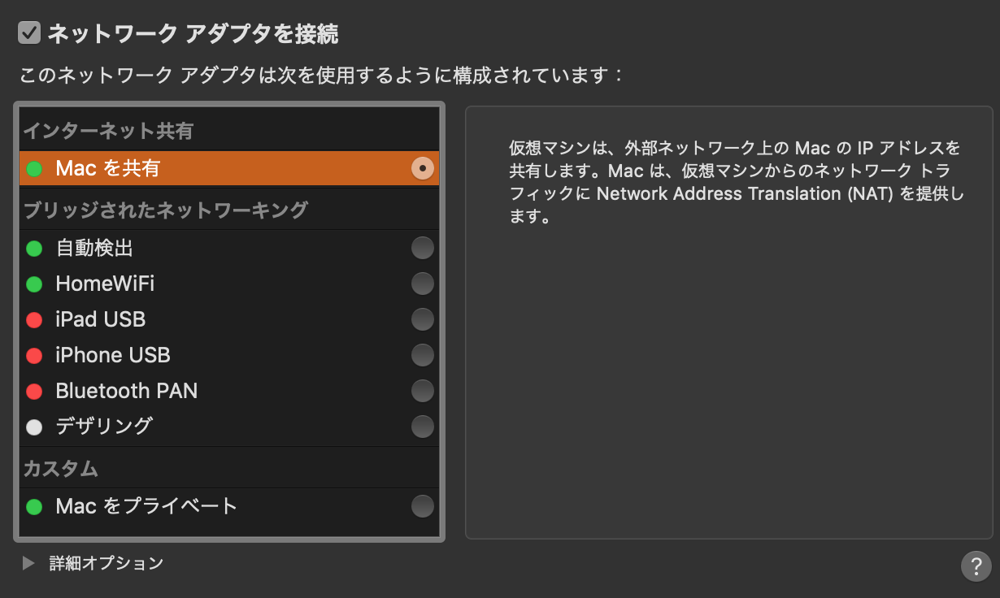

# Vagrant(VirtualBox)と VMwear Fusion をネットワーク共有

開発中のプロジェクトに VMwear 上の OS からテストやセキュリティーチェックなどしたいけれども開発中のプロジェクトをグローバルなサーバーにアップするのも[めんどくさい]{.under_line}ので VMwearFusion
のネットワークに Vagrant を設定しローカル内で完結させる。

## VMware 上の OS のネットワーク設定

VM の設定を開く


デバイスを追加をクリック



ネットワークアダプタを追加
'Mac を共有' を設定



## Vagrant 側のネットワーク設定

HostOS から VMwear ネットワークを確認

```bash
ifconfig
```

```bash
...
...
 vmnet8: flags=8963<UP,BROADCAST,SMART,RUNNING,PROMISC,SIMPLEX,MULTICAST> mtu 1500
        ether 00:50:56:c0:00:08
        inet 172.16.221.1 netmask 0xffffff00 broadcast 172.16.221.255
...
...
```

この情報を元に Vagratfile に追記 （クラス C)

```bash
 config.vm.network :public_network, :bridge => "vmnet8", ip: "172.16.221.12"
```

第 4 オクテッドはご自由に。ここでは 12 にしてます。 Vagrant を再起動。

## VMwear 上の OS から接続確認

hosts ファイル編集

```bash
vi /etc/hosts
```

host を追記 'vagrant.local'はご自由に。

```bash
172.16.221.12 vagrant.local
```

Vagrant へのネットワークを Nmap で確認

```bash
○ → nmap 172.16.221.12
```

```bash
Starting Nmap 7.80 ( https://nmap.org ) at 2019-10-01 13:46 JST
Nmap scan report for centos75.exp (172.16.221.12)
Host is up (0.00042s latency).
Not shown: 994 closed ports
PORT     STATE SERVICE
22/tcp   open  ssh
80/tcp   open  http
111/tcp  open  rpcbind
443/tcp  open  https
3000/tcp open  ppp
3306/tcp open  mysql
```

繋がりました。
