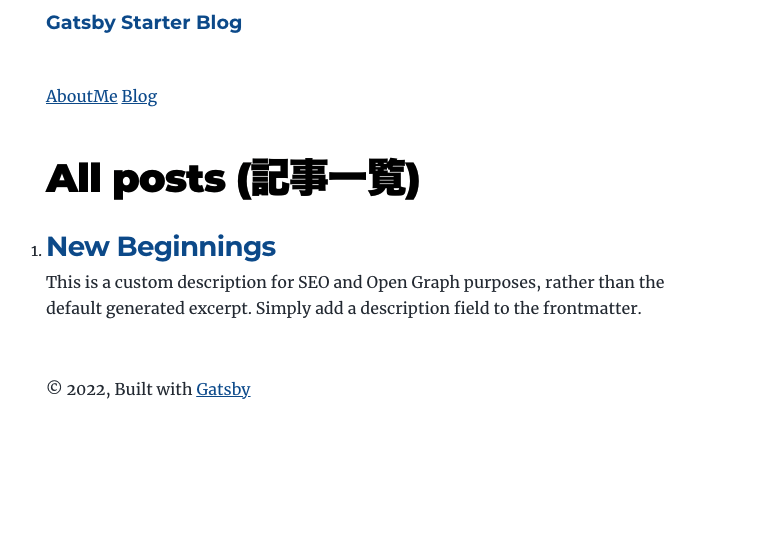

---

title: "GatsbyJS Pagination を実装する"
date: "2022-03-02 20:39:33"
post_modified: "2022-03-02 20:39:33"
description: "GatsbyJS 記事一覧ページを生成し、Pagination を実装する"
categories: ["FrontEnd"]
tags: ["GatsbyJS", "TypeScript"]
topics: "GatsbyJS"
topic_order: "8"
draft: false

---


**_Plugin なしで実装_**

## ページネーション のためのブログ一覧ページを実装

`/blog/`という 投稿一覧ページを新規追加しページネーションを実装

### まずはページネーションなしの Template を作成

`/src/tmplates/blog-list.tsx`

```tsx
import * as React from "react"
import {graphql, Link} from "gatsby"
import Layout from "../components/layout"
import Seo from "../components/seo"

const BlogList = ({data}: { data: any }) => {
  const siteTitle = data?.site?.siteMetadata?.title || `Title`
  const nodes = data.allMarkdownRemark?.nodes

  if (nodes.length === 0) {
    return (
      <Layout location={location} title={siteTitle}>
        <Seo title={nodes.frontmatter?.title || ""} description={nodes.frontmatter?.description}/>
        <p>No Post</p>
      </Layout>
    )
  } else {
    return (
      <Layout location={location} title={siteTitle}>
        <Seo title={"All posts (記事一覧)"} description={"All posts (記事一覧)"}/>
        <h1>All posts (記事一覧)</h1>
        <ol>
          {nodes.map((node: any) => {
            const title = node?.frontmatter?.title || node.fields?.slug

            return (
              <li key={node.fields?.slug} className={"postList"}>
                <article className="post-list-item">
                  <h2>
                    <Link to={"/blog" + node.fields?.slug || ""} itemProp="url">
                      <span itemProp="headline">{title}</span>
                    </Link>
                  </h2>
                  <p className="post_modified">
                    <span>{node.frontmatter?.post_modified}</span>
                  </p>
                  <p
                    className="content"
                    dangerouslySetInnerHTML={{
                      __html: node.frontmatter?.description || node?.excerpt || "",
                    }}
                    itemProp="description"
                  />
                </article>
              </li>
            )
          })}
        </ol>

        {/* <section>
            <PageNation pageContext={pageContext} />
          </section> */}
        {/* </Article> */}
      </Layout>
    )
  }
}
export default BlogList

export const pageQuery = graphql`
  query blogList {
    site {
      siteMetadata {
        title
      }
    }
    allMarkdownRemark(sort: { fields: [frontmatter___date], order: DESC }) {
      nodes {
        excerpt
        fields {
          slug
        }
        frontmatter {
          date(formatString: "MMMM DD, YYYY")
          title
          description
          tags
        }
      }
    }
  }
`
```

### 記事一覧に表示させる記事数を決める

gatsby-node./index.ts

```tsx
// テストのため便宜上 1
const postsPerPage = 1
```

### 記事一覧に表示させる記事数分割したページ数分のページを生成

gatsby-node./index.ts

creatPage 内に

```tsx
export const createPages: GatsbyNode["createPages"] = async ({graphql, actions, reporter}) => {
...
...
  ここに下記を追加
...
...
}
```

下記を追加

```tsx
////////////////////////////////////////////////
///   blog list
////////////////////////////////////////////////
const listTemplate = path.resolve("src/templates/blog-list.tsx") //パス
const numPages = Math.ceil(posts.length / postsPerPage) //記事数 ÷ 表示させる記事数

Array.from({length: numPages}).forEach((_, i) => {
  createPage({
    path: i === 0 ? `/blog/` : `/blog/page/${i + 1}/`,
    component: listTemplate,
    context: {
      limit: postsPerPage, //表示させる記事の制限数
      skip: i * postsPerPage, //新しい記事からスキップさせる記事数
      currentPage: i + 1,
      numPages: numPages,
      linkPrefix: `/blog`,
      linkSuffix: "/page/",
    },
  })
})
```

```tsx
////////////////////////////////////////////////
///   blog list
////////////////////////////////////////////////
const listTemplate = path.resolve("src/templates/blog-list.tsx") //パス
const numPages = Math.ceil(posts.length / postsPerPage) //記事数 ÷ 表示させる記事数

Array.from({length: numPages}).forEach((_, i) => {
  createPage({
    path: i === 0 ? `/blog/` : `/blog/page/${i + 1}/`,
    component: listTemplate,
    context: {
      limit: postsPerPage, //表示させる記事の制限数
      skip: i * postsPerPage, //新しい記事からスキップさせる記事数
      currentPage: i + 1,
      numPages: numPages,
      linkPrefix: `/blog`,
      linkSuffix: "/page/",
    },
  })
})
```

再起動

```bash
yarn start
```

### Global Lnk を実装

src/components/layout.tsx

```tsx
<nav>
  <Link to="/about/">AboutMe</Link>&nbsp;
  <Link to="/blog/">Blog</Link>
</nav>
```

### /blog/ ページ確認

<http://localhost:8000/blog/>


<http://localhost:8000/blog/page/2/>  
<http://localhost:8000/blog/page/3/>

も同じページが表示される

<http://localhost:8000/blog/page/4/>  
は 404

1 ページ 1Post なのでページは 3 ページの生成となる。

## 各ページの表示数を調整する

1 ページ 1Post のはずが すべて表示されているので 1 ページ 1Post に調整する。

`/src/tmplates/blog-list.tsx`

pageQuery 編集

```tsx
export const pageQuery = graphql`
  query blogList($skip: Int!, $limit: Int!) {
    site {
      siteMetadata {
        title
      }
    }
    allMarkdownRemark(skip: $skip, limit: $limit, sort: { fields: [frontmatter___date], order: DESC }) {
      nodes {
        excerpt
        fields {
          slug
        }
        frontmatter {
          date(formatString: "MMMM DD, YYYY")
          title
          description
          tags
        }
      }
    }
  }
`
```

### 表示数確認

<http://localhost:8000/blog/>  
<http://localhost:8000/blog/page/2/>  
<http://localhost:8000/blog/page/3/>

それぞれ



1 ページ 1Post で表示できた。

## ページ下部にページネーションを実装

他のコンテンツでも必要になることが予想されるため Component として実装する

src/components/pageNation.tsx

```tsx
import React from "react"
import {Link} from "gatsby"
import styled from "styled-components"

const PageNation = ({pageContext}: { pageContext: any }) => {
  const {numPages} = pageContext
  const currentPage = pageContext.currentPage
  const linkPrefix = pageContext.linkPrefix
  const linkSuffix = pageContext.linkSuffix
  return (
    <nav>
      <UlWrapper>
        {Array.from({length: numPages}, (_, i) => (
          <li key={`pagination-number${i + 1}`} className={`${i + 1}` == currentPage ? "thisPage" : "etherPage"}>
            <Link to={`${linkPrefix}${i === 0 ? "" : linkSuffix}${i === 0 ? "" : i + 1}/`}>{i + 1}</Link>
          </li>
        ))}
      </UlWrapper>
    </nav>
  )
}
export default PageNation
const UlWrapper = styled.ul`
  display: flex;
  justify-content: center;

  li {
    display: block;
    width: 3em;
    text-align: center;
    margin: 0 0.2em;
  }
  li.thisPage {
    background-color: #ddd;
  }
`
```

### Template に ページネーション反映

`src/templetes/blog-list.tsx`

```tsx
import * as React from "react"
import {graphql, Link} from "gatsby"
import Layout from "../components/layout"
import Seo from "../components/seo"
import PageNation from "../components/pageNattion"

const BlogList = ({data, pageContext}: { data: any; pageContext: any }) => {
  const siteTitle = data?.site?.siteMetadata?.title || `Title`
  const nodes = data.allMarkdownRemark?.nodes

  if (nodes.length === 0) {
    return (
      <Layout location={location} title={siteTitle}>
        <Seo title={nodes.frontmatter?.title || ""} description={nodes.frontmatter?.description}/>
        <p>No Post</p>
      </Layout>
    )
  } else {
    return (
      <Layout location={location} title={siteTitle}>
        <Seo title={"All posts (記事一覧)"} description={"All posts (記事一覧)"}/>
        <h1>All posts (記事一覧)</h1>
        <ol>
          {nodes.map((node: any) => {
            const title = node?.frontmatter?.title || node.fields?.slug

            return (
              <li key={node.fields?.slug} className={"postList"}>
                <article className="post-list-item">
                  <h2>
                    <Link to={"/blog" + node.fields?.slug || ""} itemProp="url">
                      <span itemProp="headline">{title}</span>
                    </Link>
                  </h2>
                  <p className="post_modified">
                    <span>{node.frontmatter?.post_modified}</span>
                  </p>
                  <p
                    className="content"
                    dangerouslySetInnerHTML={{
                      __html: node.frontmatter?.description || node?.excerpt || "",
                    }}
                    itemProp="description"
                  />
                </article>
              </li>
            )
          })}
        </ol>

        <section>
          <PageNation pageContext={pageContext}/>
        </section>
      </Layout>
    )
  }
}
export default BlogList

export const pageQuery = graphql`
  query blogList($skip: Int!, $limit: Int!) {
    site {
      siteMetadata {
        title
      }
    }
    allMarkdownRemark(skip: $skip, limit: $limit, sort: { fields: [frontmatter___date], order: DESC }) {
      nodes {
        excerpt
        fields {
          slug
        }
        frontmatter {
          date(formatString: "MMMM DD, YYYY")
          title
          description
          tags
        }
      }
    }
  }
`
```

#### 編集箇所

```tsx
// import component
import PageNation from "../components/pageNattion"
```

```tsx
// props に pageContextを追加
const BlogList = ({data, pageContext}: { data: any; pageContext: any }) => {

```

```tsx
// Component 配置 及び props
<section>
  <PageNation pageContext={pageContext}/>
</section>
```

#### ページネーション確認


