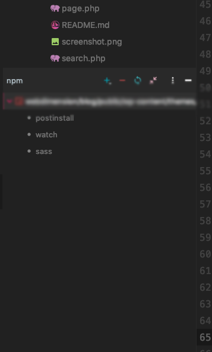
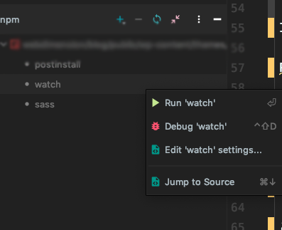
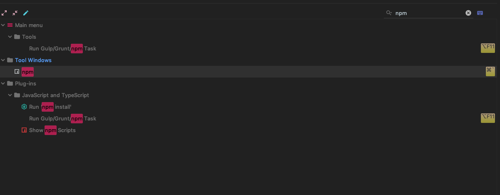
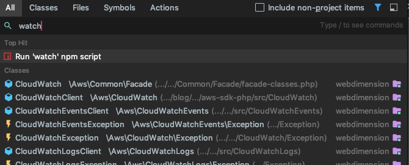
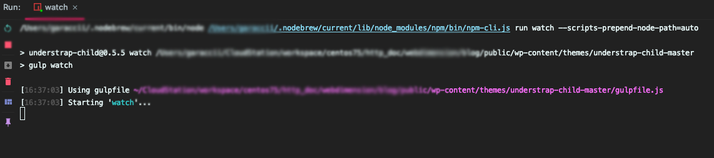

# Intellij idea から npm を操作

昨今の WEB 制作では CSS や JavaScript はビルドするという手法です。\
'gulp'や'webpack'などのツールを使うことが多いでしょう。\
最近は 'webpack' が主流のようです。
Bootstrap も Version4 より Sass が採用されました。\
'webpack'は Git 同様必須となりそうです。

## Wordpress のテーマ Understrap の Package.json

Understrap の Sass で例えると、

```source
{
  "name": "understrap-child",
  "version": "0.5.5",
  "description": "Basic Child Theme for UnderStrap Theme Framework: https://github.com/holger1411/understrap",
  "main": "index.js",
  "scripts": {
    "postinstall": "gulp copy-assets",
    "watch": "gulp watch",
    "sass": "gulp sass"
  },
...
...
...
...
...
```

この "scripts" の内容を実行するのですが、おっさんはすぐにターミナルを開き
**'package.json'** のあるディレクトリまで移動し

```bash
npm run watch
```

などします。ターミナルでの操作はそれはそれでいいのですが毎回やるのは正直めんどくさいです。\
それに 'watch'にすると Background で動くためターミナルのタブ一枚占領します。\
また、エラー確認のためエディタとターミナルを行ったりきたり。\
ショートカット使ったとしても・・・めんどくさい。\
なのでこの一連のアクションは IDEA でやることにしました。\
**結果**\
やっぱり楽になりました。

## npm 設定手順

**環境**

- MAC
- node.js がインストール済み
- Intellij IDEA (Phpstorm,Webstorm など)

---

1.  'cmd' + ',' を押下し設定を開く
2.  'cmd' + 'f' を押下し npm を検索
3.  Preferences \| Languages & Frameworks \| Node.js and NPM へ進む
4.  'node','npm'の Path を設定


Projct tool window の 'package.json' を右クリック。


'Show npm script' をクリック。 'npm'の window が開きます。



ここには 'Package.json' の Scripts 内のコマンドがリストされます。\
実行したい Script 名を右クリックして実行です。



## Npm window を開くためのショートカット

マウスやトラックパッドを使って右クリックなどはめんどくさいのでショートカットを設定します。

1.  'cmd' + ',' を押下し設定を開く
2.  Preferences \| Keymap へ進む。
3.  'npm'で検索し ショートカットキーを割り当てる



これでだいぶん楽になる。

## IDEA 「なんでも検索」 を使う

それでも[めんどくさい]{.under_line}という場合、
"ただただ、'npm run watch' を走らせたいんだ" という場合は IDEA の超便利機能
「なんでも検索」の出番です。

1.  'Shift' x 2 （連打) で「なんでも検索」
2.  'watch' をタイプ、"Run 'watch' npm script" が出てくるので Enter。



実行後はこんな感じです。



IDEA の「なんでも検索」はほんとすごい。快適です。
