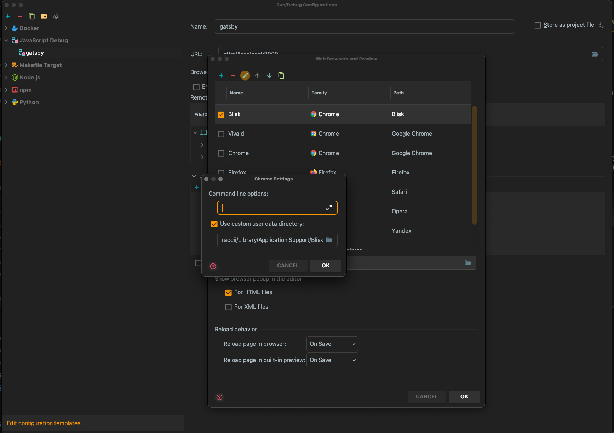

`http://localhost:8000`などで動いているWEBアプリをブラウザデバッグする際デフォルト設定では クリーンな(Add ON なし、インストールしたてのような)`Chrome`が立ち上がる。

できるならば日常使っている設定のままデバッグが立ち上がってほしい。

`Run/Debug設定` -> `Browser` 下記の箇所の **user data directory** を 指定する。



Macの場合

``` bash
# Bliskの場合
~/Library/Application Support/Blisk
```

``` bash
# Chromeの場合
~/Library/Application Support/google/chrome
```

一度デバッグを停止し他のブラウザのとSessionを断ち再度デバッグ <kbd>ctl</kbd> + <kbd>D</kbd> で通常の設定のままのブラウザが起動する。