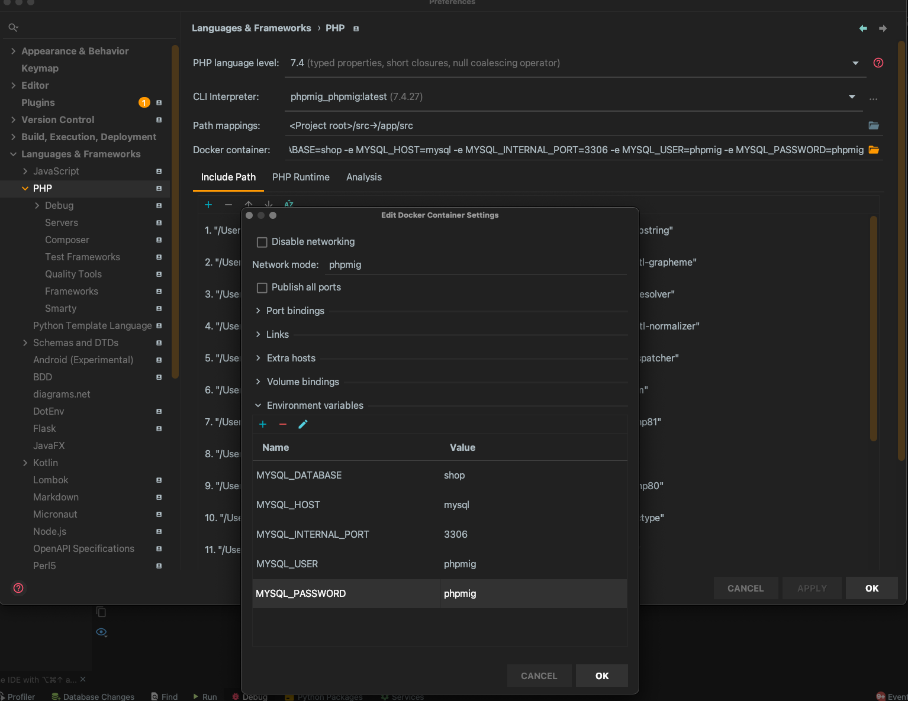
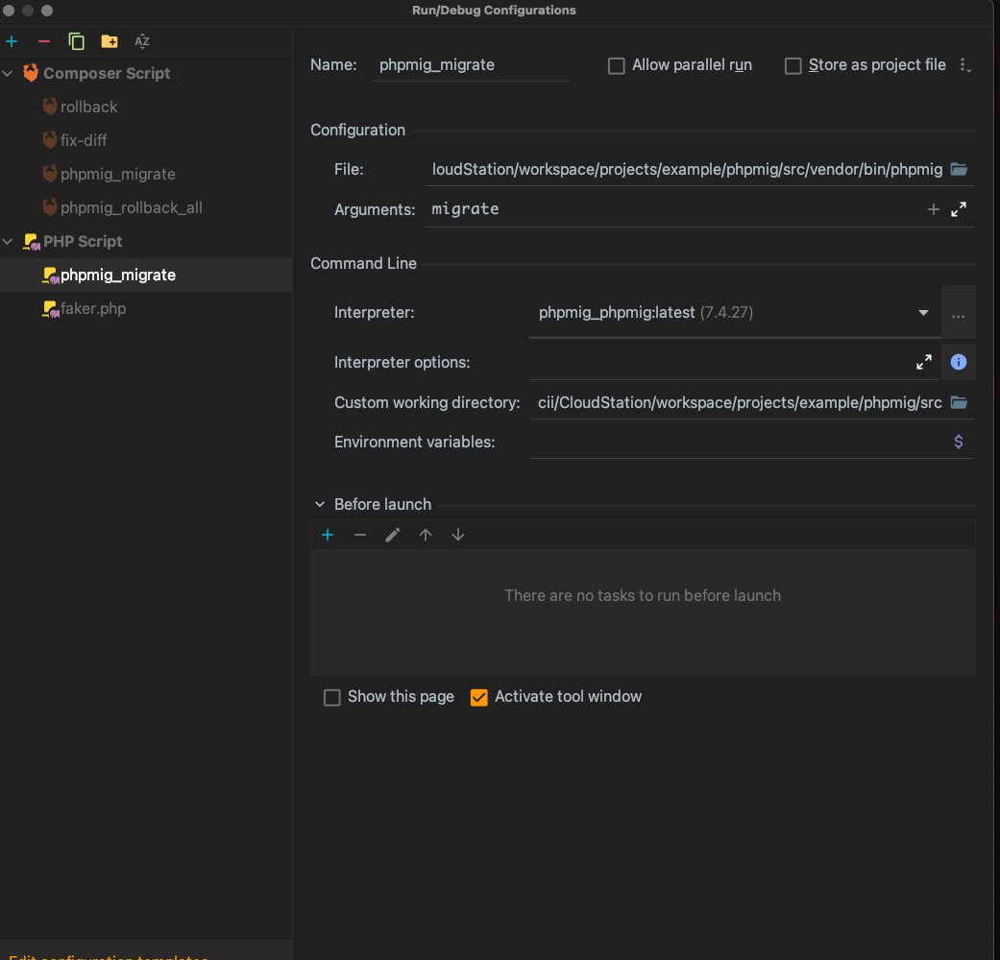

## Preferences | Languages & Frameworks | PHP

- cli-interpreter でコンテナ選択
- 別コンテナの DB に接続してのデバッグを行うときは接続情報などを環境変数に登録
  (docker-compose.yml の environment:)

  ```yaml
  environment:
  MYSQL_DATABASE: ${DB_DATABASE}
  MYSQL_USER: ${DB_USER}
  MYSQL_PASSWORD: ${DB_PASSWORD}
  MYSQL_ROOT_PASSWORD: ${DB_ROOT_PASSWORD}
  ```

- 別コンテナの DB に接続してのデバッグを行うときはネットワーク設定をする

  ```bash
  docker network create xxx
  ```

  (docker-compose.yml の netword:)

  ```yaml
  networks:
  default:
    external:
      name: ${NETWORK_NAME}
  ```



## composer のライブラリからの Debug

- ファイルの指定は`vendor/bin/xxx`
- Custom Working Directory に`composer.json`のあるディレクトリ(root ディレクトリ)


