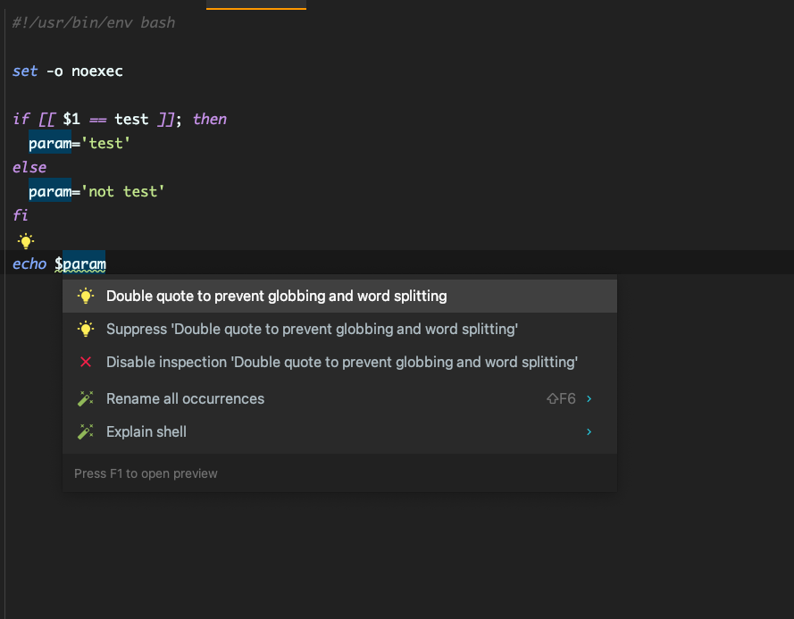

## noexec オプション

```bash
#!/usr/bin/env bash

set -o noexec
```

実際に実行はしない  
構文チェックや DryRun といった振る舞い

構文エラー時は

```bash
行 11: 構文エラー: 予期しないファイル終了 (EOF) です
```

のようなエラー表示

## shellcheck

### Install

#### ubuntu

```bash
sudo apt-get install shellcheck
```

#### Mac

```bash
brew install shellcheck
```

### Exec shellcheck

source sc.sh

```bash
#!/usr/bin/env bash

set -o noexec

if [[ $1 == test ]]; then
 param='test'
else
 param='not test'
fi

echo "$param"
```

```bash
shellcheck sc.sh
```

エラーなし

source sc.sh (echo " を外す)

```bash
#!/usr/bin/env bash

set -o noexec

if [[ $1 == test ]]; then
 param='test'
else
 param='not test'
fi

echo $param
```

```bash
shellcheck sc.sh
```

```bash

In sc.sh line 11:
echo $param
     ^----^ SC2086 (info): Double quote to prevent globbing and word splitting.

Did you mean: 
echo "$param"

For more information:
  https://www.shellcheck.net/wiki/SC2086 -- Double quote to prevent globbing ...
```

エラーを指摘される。エラーの詳細はリンク先で確認

Intellij IDEA ではエディタ上で表示してくれる。


