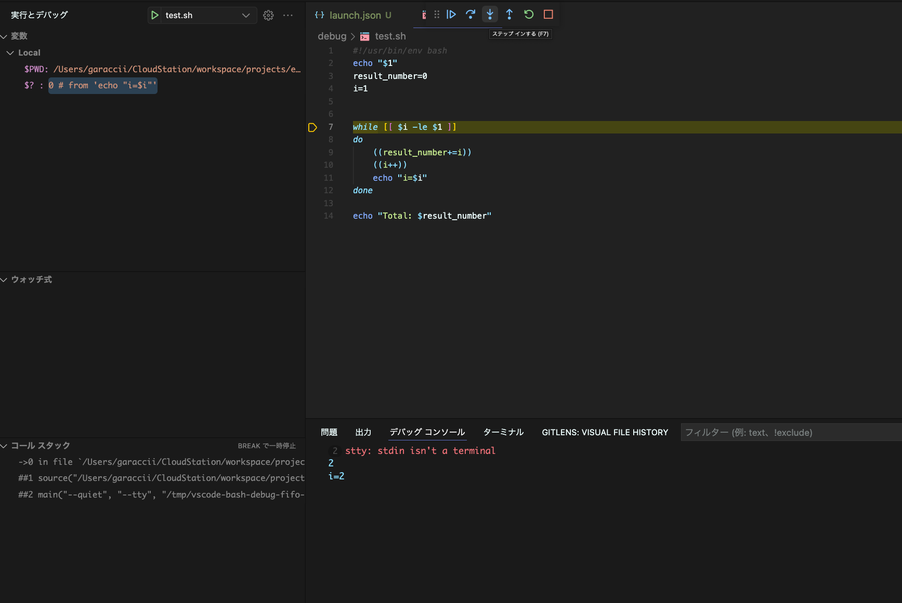
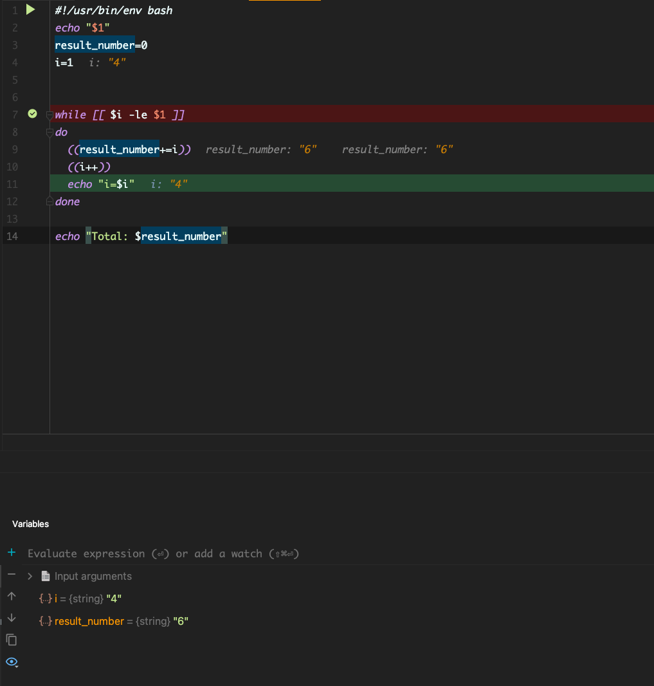

## Bssh のオプションでデバッグ設定

### シェルスクリプトのデバッグでよく使われるオプション

| ソース内に記述する場合 | コマンドラインから | 内容                             |
|-------------|-----------|--------------------------------|
| verbose     | -v        | コマンドを表示                        |
| xtrace      | -x        | 実行したコマンドを表示                    |
| nounset     | -u        | 未定義の変数をエラー扱い                   |
| errexit     | -e        | コマンドの終了ステータスが 0 以外が帰ってくると処理を終了 |

#### verbose コマンドを表示

source

```bash
#!/usr/bin/env bash

set -o verbose

cd /bin || exit
ls
#
cd /etc || exit
ls
```

##### verbose ありの場合

```bash
cd /bin || exit
ls
[               cp              dd              expr            launchctl       mkdir           pwd             sleep           test
bash            csh             df              hostname        link            mv              rm              stty            unlink
cat             dash            echo            kill            ln              pax             rmdir           sync            wait4path
chmod           date            ed              ksh             ls              ps              sh              tcsh            zsh
#
cd /etc || exit
ls
afpovertcp.cfg                          find.codes~orig                         newsyslog.conf                          rc.netboot
afpovertcp.cfg~orig                     fstab.hd~previous                       newsyslog.d                             resolv.conf
aliases                                 ftpusers                                nfs.conf                                rmtab
aliases.db                              ftpusers~orig                           nfs.conf~orig                           rpc
apache2                                 gettytab                                notify.conf                             rpc~previous
asl                                     gettytab~orig                           ntp.conf                                rtadvd.conf
asl.conf                                group                                   ntp.conf~orig                           rtadvd.conf~previous
auto_home                               group~previous                          ntp_opendirectory.conf                  security
auto_master                             hosts                                   openldap                                services
auto_master~orig                        hosts.equiv                             pam.d                                   services~previous
autofs.conf                             hosts~orig                              passwd                                  shells
bashrc                                  irbrc                                   paths                                   shells~orig
bashrc_Apple_Terminal                   kern_loader.conf                        paths.d                                 snmp
bashrc~previous                         kern_loader.conf~previous               paths~orig                              ssh
bootpd.plist                            krb5.keytab                             periodic                                ssl
com.apple.mis.rtadvd.conf               krb5.keytab~orig                        pf.anchors                              sudo_lecture
com.apple.screensharing.agent.launchd   localtime                               pf.conf                                 sudoers
csh.cshrc                               localtime~orig                          pf.os                                   sudoers.d
csh.cshrc~orig                          locate.rc                               php.ini.default-previous                sudoers~orig
csh.login                               mail.rc                                 php.ini.default-previous~orig           syslog.conf
csh.login~orig                          mail.rc~orig                            postfix                                 syslog.conf~previous
csh.logout                              man.conf                                ppp                                     ttys
csh.logout~orig                         manpaths                                profile                                 ttys~previous
cups                                    manpaths.d                              profile~orig                            uucp
defaults                                master.passwd                           protocols                               wfs
emond.d                                 master.passwd~orig                      protocols~previous                      xtab
exports                                 nanorc                                  racoon                                  zprofile
exportsbak                              networks                                rc.common                               zshrc
find.codes                              networks~orig                           rc.common~previous                      zshrc_Apple_Terminal

```

##### verbose なしの場合

```bash
[               cp              dd              expr            launchctl       mkdir           pwd             sleep           test
bash            csh             df              hostname        link            mv              rm              stty            unlink
cat             dash            echo            kill            ln              pax             rmdir           sync            wait4path
chmod           date            ed              ksh             ls              ps              sh              tcsh            zsh
afpovertcp.cfg                          find.codes~orig                         newsyslog.conf                          rc.netboot
afpovertcp.cfg~orig                     fstab.hd~previous                       newsyslog.d                             resolv.conf
aliases                                 ftpusers                                nfs.conf                                rmtab
aliases.db                              ftpusers~orig                           nfs.conf~orig                           rpc
apache2                                 gettytab                                notify.conf                             rpc~previous
asl                                     gettytab~orig                           ntp.conf                                rtadvd.conf
.....
```

#### xtrace 実行したコマンドを表示

```bash
set -o xtrace
```

```bash
+ cd /bin
+ ls
[               cp              dd              expr            launchctl       mkdir           pwd             sleep           test
bash            csh             df              hostname        link            mv              rm              stty            unlink
cat             dash            echo            kill            ln              pax             rmdir           sync            wait4path
chmod           date            ed              ksh             ls              ps              sh              tcsh            zsh
+ cd /etc
+ ls
afpovertcp.cfg                          find.codes~orig                         newsyslog.conf                          rc.netboot
afpovertcp.cfg~orig                     fstab.hd~previous                       newsyslog.d                             resolv.conf
aliases                                 ftpusers                                nfs.conf                                rmtab
......
```

##### 行番号を表示

```bash
#!/usr/bin/env bash

set -o xtrace
set -o verbose

export PS4='> $LINENO: '
```

#### nounset 未定義の変数をエラー扱い

source test.sh

```bash
#!/usr/bin/env bash

set -o xtrace
set -o verbose
set -o nounset

export PS4='> $LINENO: '

var1='No1'
var2='No2'

echo $var1
echo $var2
echo $var3
```

結果

```bash
+ set -o verbose
set -o nounset
+ set -o nounset

export PS4='> $LINENO: '
+ export 'PS4=> $LINENO: '
+ PS4='> $LINENO: '

var1='No1'
> 9: var1=No1
var2='No2'
> 10: var2=No2

echo $var1
> 12: echo No1
No1
echo $var2
> 13: echo No2
No2
echo $var3
./test.sh: 行 14: var3: 未割り当ての変数です

```

#### errexit コマンドの終了ステータスが 0 以外が帰ってくると処理

#### errexit ありの場合

```bash
#!/usr/bin/env bash
set -o errexit

export PS4='> $LINENO: '

new_dir_name='new_dir'
new_file_name='new_file.txt'

echo 'create new directory'
mkdir "./undefined_dir/$new_dir_name"
echo 'create text file'
touch "./undefined_dir/$new_dir_name/$new_file_name"

```

```bash
create new directory
mkdir: ./undefined_dir: No such file or directory
```

#### errexit なしの場合

```bash
create new directory
mkdir: ./undefined_dir: No such file or directory
create text file
touch: ./undefined_dir/new_dir/new_file.txt: No such file or directory
```

エラーが発生してもその後の処理が行われている

### 所感

デバッグに限らず

```bash
set -o nounset
set -o errexit
```

は常に ON のままのほうが良い気がする。

## bashdb (デバッグツール)

### bashdb インストール

#### ubuntu (ubunt20)

```bash
cd /tmp
wget https://sourceforge.net/projects/bashdb/files/bashdb/5.0-1.1.2/bashdb-5.0-1.1.2.tar.gz/download?use_mirror=jaist&use_mirror=jaist&r=https%3A%2F%2Fsourceforge.net%2Fprojects%2Fbashdb%2Ffiles%2Fbashdb%2F5.0-1.1.2%2F
tar -zcvf  bashdb-5.0-1.1.2.tar.gz
cp -rf bashdb-5.0-1.1.2 /usr/local/src
cd /usr/local/src/bashdb-5.0-1.1.2
./configure
make && make check
su -c 'make install'
```

#### mac

```bash
brew install bashdb
```

### Exec bashdb

source

```bash
#!/usr/bin/env bash
echo "$1"
result_number=0
i=1


while [[ $i -le $1 ]]
do
	((result_number+=i))
	((i++))
	echo "i=$i"
done

echo "Total: $result_number"
```

```bash
bashdb test.sh -- 4
```

引数は -- x で渡す

```bash
2:      echo "$1"
bashdb<0> 
```

`step` を入力、次の行へ

```bash
print $result_number 
```

変数の値を表示

`q`  で終了

#### プラグイン

### VSCode

`Bash Debug`



ブレークポイントもはれる。

### Intellij IDEA

`BashSupport Pro` (有料)



ブレークポイントもはれる。