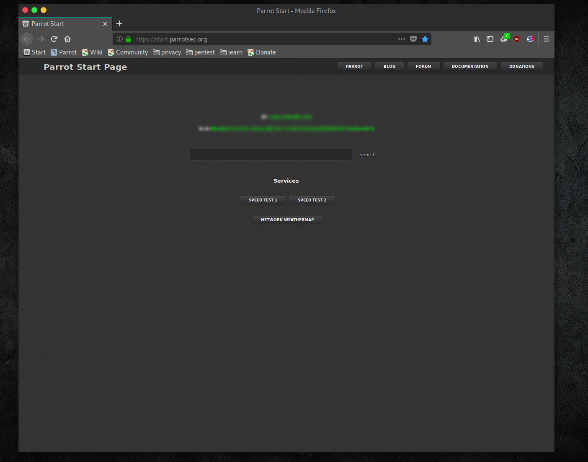

# Parrot Security OS

ずっと使っていた Version4.2 が無理しすぎたせいか動きがわるくなったので 4.7 へ移行してみた。

**Parrot Security OS** とはその名前から "**Security**に特化した OS" というのは推測できますが **ペネレーションテスト**や**リバースエンジニアリング**だけでなく Office 系も**
プログラミング**もほぼ全てに精通した OS というのは過大評価ではないのではと思います。

**ペネレーションテス**トといえば真っ先に"**Kali Linux**"というイメージもありますが"P**arrot Security OS**"は"**Kali Linux**"のツールをほぼほぼ搭載しています。
"**Kali Linux**"以上かもしれません。 どちらも**Debian**系の OS です。

イタリア製というのもあってか美しいです


何かひらくと


Office 系(**libreOffice**)


ブラウザは**Firefox**がデフォルトです。
"TOR ブラウザ"もデフォルトで搭載してまがここでは触れません。



## VMwear 上に Parrot Security OS をインストール

環境

- MAC mojave
- VMwear Fusion 11.5.0

OS
のイメージファイルは本家[Parrot Security OS](https://parrotlinux.org/)からダウンロードするのも良いですし、[osboxes.org](https://www.osboxes.org/parrot-security-os/)から
VMwear 用のイメージをダウンロードしてもいいでしょう。 今回は[osboxes.org](https://www.osboxes.org/parrot-security-os/)からインストールしました。

VMwera への OS のインストールはここでは触れません。 簡単にできますので。

## Prrot Security OS に追加でインストール

**Prrot Security OS**にはデフォルトで一般的なアプリは入っています。
**Vim**は**Nvim**がインストールされてました。 以下を追加でインストールしました。 USER_NAME は設定されているものに変更してください。 例) oxboxes.org

```bash
#sudo su をパスワードなしで行える設定
sudo addgroup wheel
sudo usermod -aG wheel USER_NAME

vim /etc/pam.d/su
#追記

auth sufficient pam_wheel.so trust group=wheel
sudo visudo
#追記
USER_NAME  ALL=NOPASSWD: ALL
%wheel ALL=(ALL) NOPASSWD:ALL
```

```bash
#日本語入力
apt install -y ibus-mozc
```

```bash
#なくてもいいツール(個人の趣味)
## neofetch
apt install neofetch
## glances
apt install glances
## bash_it
git clone --depth=1 https://github.com/Bash-it/bash-it.git ~/.bash_it
~/.bash_it/install.sh
## lolcat
sudo apt-get install lolcat
## Terminology 動画も画像も扱えるTerminal
sudo apt-get install terminology

## tmuxinator
gem install tmuxinator
## tmux使用時のコピペに必要
sudo apt install xsel
```

## Tmux が動かない

いつも**Tmuxinator**を使ているので 4.2 の設定をそのまま持ってきたところ**Tmuxinator**が起動しない。(Tmux)
調べたところ

```bash
# ステータスバーの色を設定する
set-option -g status-fg black
set-option -g status-bg "colour237"

# ウィンドウリストの色を設定する
setw -g window-status-fg white
setw -g window-status-bg black
setw -g window-status-attr dim
# アクティブなウィンドウを目立たせる
setw -g window-status-current-fg black
setw -g window-status-current-bg "colour68"
setw -g window-status-current-attr bright

# ペインボーダーの色を設定する
set -g pane-border-fg "colour237"
set -g pane-border-bg "colour237"
# アクティブなペインを目立たせる
set -g pane-active-border-fg "colour68"
set -g pane-active-border-bg  "colour237"

# コマンドラインの色を設定する
set -g message-fg white
set -g message-bg black
set -g message-attr bright
```

ここらへんでエラーになる。 ググったところ**Tmux**のバージョンの違いによる設定ファイルの記述らしい。
[参考サイト](https://qiita.com/TsutomuNakamura/items/663b8e456768f29e37ed)

変更後

```bash
# ステータスバーの色を設定する
 set-option -g status-style fg="black"
 set-option -g status-style bg="colour237"
#
## ウィンドウリストの色を設定する
 setw -g window-status-style fg="white"
 setw -g window-status-style bg="black","dim"
# setw -g window-status-attr dim

## アクティブなウィンドウを目立たせる
 setw -g window-status-current-style fg="black"
 setw -g window-status-current-style bg="colour68","bright"
# setw -g window-status-current-style attr="bright"
#
## ペインボーダーの色を設定する
 set -g pane-border-style fg="colour237"
 set -g pane-border-style bg="colour237"

## アクティブなペインを目立たせる
# set -g pane-active-border-style fg="colour68"
# set -g pane-active-border-style bg="colour237"
#
## コマンドラインの色を設定する
 set -g message-style fg="white"
 set -g message-style bg="black","bright"
#set -g message-style attr="bright"
```

で無事 4.2 同様動かすことができました。

## Kali Linus VS Parrot Security OS

なんて記事もありますが適材適所かと思います。 HostOS 側の開発環境への**ペネレーションテスト**や**セキュリティーチェック**などは VM 上の**Kalli Linux**という使いかたはありかと思います。
**Parrot Security OS**は実機で使ってこそパフォーマンスを発揮するような感じです。

ということで**Parrot Security OS**を実機で持ちたい・・・ が、**Parrot Srcurity OS**は日本語での情報は皆無と言っていいくらい厳しいです。 英語、中国語では活発なコミュニティーがあるようです。

最近の MAC では Bootcamp で Linux は無理のようだし、WindowsPC ならインストールできるのか、**Kali Linux**のように"Think pad と相性がいい"とかあるのだろうか・・・

今後の課題です。
