##  ULM (アクティビティ図)

ちょっとの間離れるとすぐ忘れてしまうので備忘録として。。。

基本的な書き方だけ。

参考

[State Diagram](https://plantuml.com/activity-diagram-beta)

### Simple action 

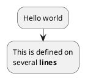

### Start/Stop

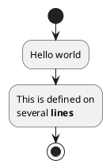

### Start/End

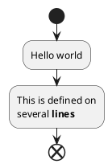

### Conditional

#### if (...) then (...)
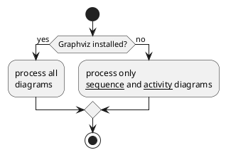
#### if (...) is (...) then 

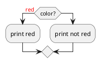

### if (...) equals (...) then

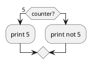

### Several tests (horizontal mode)

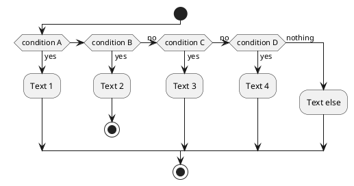

### Several tests (vertical mode)

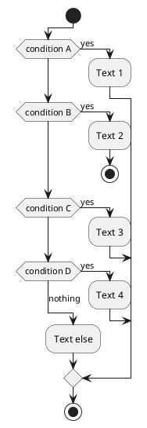

### Switch and case [switch, case, endswitch]

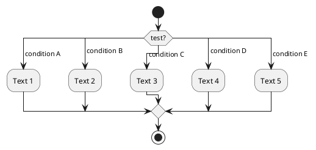

### Conditional with stop on an action [kill, detach]

#### stop action on a if loop 

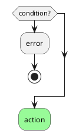

### kill or detach keyword

#### kill

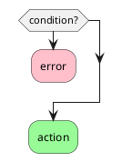

#### detach


### Repeat loop

#### epeat and repeatwhile keywords to have repeat loops

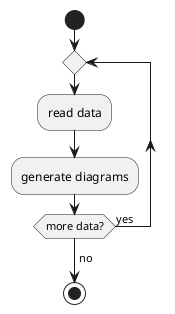

####  target and insert an action in the return path using the backward keyword

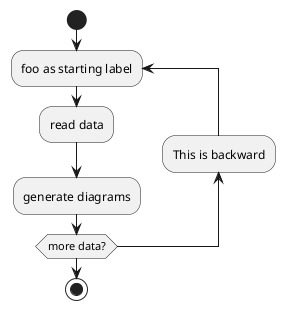


### Break on a repeat loop [break]

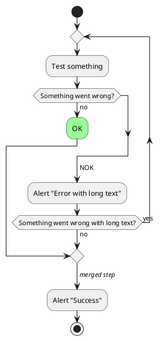

### While loop

#### while and endwhile keywords to have repeat loops

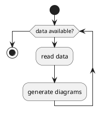

#### label after the endwhile keyword, or using the is keyword.

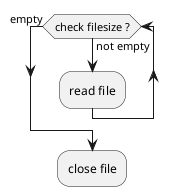

#### detach to form an infinite while loop, then you will want to also hide the partial arrow that results using

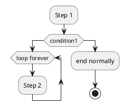

### Parallel processing

#### fork

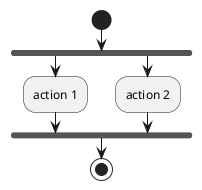

#### fork with end merge

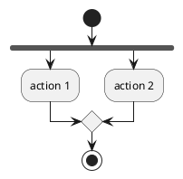

```plantuml
@startuml
start
fork
  :action 1;
fork again
  :action 2;
  end
end merge
stop
@enduml

```

#### Label on end fork

```plantuml
@startuml
start
fork
  :action A;
fork again
  :action B;
end fork {or}
stop
@enduml
```

```plantuml
@startuml
start
fork
  :action A;
fork again
  :action B;
end fork {and}
stop
@enduml
```

#### Other example

```plantuml
@startuml

start

if (multiprocessor?) then (yes)
  fork
    :Treatment 1;
  fork again
    :Treatment 2;
  end fork
else (monoproc)
  :Treatment 1;
  :Treatment 2;
endif

@enduml
```

### Split processing

#### Split

```plantuml
@startuml
start
split
   :A;
split again
   :B;
split again
   :C;
split again
   :a;
   :b;
end split
:D;
end
@enduml
```

#### Input split (multi-start)

```plantuml
	
@startuml
split
   -[hidden]->
   :A;
split again
   -[hidden]->
   :B;
split again
   -[hidden]->
   :C;
end split
:D;
@enduml
```

```plantuml
@startuml
split
   -[hidden]->
   :A;
split again
   -[hidden]->
   :a;
   :b;
split again
   -[hidden]->
   (Z)
end split
:D;
@enduml
```

### Output split (multi-end)

```plantuml
@startuml
start
split
   :A;
   kill
split again
   :B;
   detach
split again
   :C;
   kill
end split
@enduml
```

```plantuml
@startuml
start
split
   :A;
   kill
split again
   :b;
   :c;
   detach
split again
   (Z)
   detach
split again
   end
split again
   stop
end split
@enduml
```

### notes

```plantuml
@startuml

start
:foo1;
floating note left: This is a note
:foo2;
note right
  This note is on several
  //lines// and can
  contain <b>HTML</b>
  ====
  * Calling the method ""foo()"" is prohibited
end note
stop

@enduml
```

#### add note on backward activity

```plantuml
@startuml
start
repeat :Enter data;
:Submit;
backward :Warning;
note right: Note
repeat while (Valid?) is (No) not (Yes)
stop
@enduml
```

#### add note on partition activity

```plantuml
@startuml
start
partition "**process** HelloWorld" {
    note
        This is my note
        ----
        //Creole test//
    end note
    :Ready;
    :HelloWorld(i)>
    :Hello-Sent;
}
@enduml
```

### Colors

```plantuml
@startuml

start
:starting progress;
#HotPink:reading configuration files
These files should be edited at this point!;
#AAAAAA:ending of the process;

@enduml
```

```plantuml
@startuml
start
partition #red/white testPartition {
        #blue\green:testActivity;
}
@enduml
```

#### Lines without arrows

```plantuml
@startuml
skinparam ArrowHeadColor none
start
:Hello world;
:This is on defined on
several **lines**;
stop
@enduml
```

```plantuml
@startuml
skinparam ArrowHeadColor none
start
repeat :Enter data;
:Submit;
backward :Warning;
repeat while (Valid?) is (No) not (Yes)
stop
@enduml
```

### Arrows

```plantuml
@startuml
:foo1;
-> You can put text on arrows;
if (test) then
  -[#blue]->
  :foo2;
  -[#green,dashed]-> The text can
  also be on several lines
  and **very** long...;
  :foo3;
else
  -[#black,dotted]->
  :foo4;
endif
-[#gray,bold]->
:foo5;
@enduml
```

### Connector

```plantuml
@startuml
start
:Some activity;
(A)
detach
(A)
:Other activity;
@enduml
```

### color on connector

```plantuml
@startuml
start
:The connector below
wishes he was blue;
#blue:(B)
:This next connector
feels that she would
be better off green;
#green:(G)
stop
@enduml
```

### Grouping or partition

#### Group

```plantuml
@startuml
start
group Initialization 
    :read config file;
    :init internal variable;
end group
group Running group
    :wait for user interaction;
    :print information;
end group

stop
@enduml
```

#### Partition

```plantuml
@startuml
start
partition Initialization {
    :read config file;
    :init internal variable;
}
partition Running {
    :wait for user interaction;
    :print information;
}

stop
@enduml
```

```plantuml
@startuml
start
partition #lightGreen "Input Interface" {
    :read config file;
    :init internal variable;
}
partition Running {
    :wait for user interaction;
    :print information;
}
stop
@enduml
```

### Detach or kill [detach, kill]

#### detach

```plantuml
@startuml
 :start;
 fork
   :foo1;
   :foo2;
 fork again
   :foo3;
   detach
 endfork
 if (foo4) then
   :foo5;
   detach
 endif
 :foo6;
 detach
 :foo7;
 stop
@enduml
```

#### kill

```plantuml
@startuml
 :start;
 fork
   :foo1;
   :foo2;
 fork again
   :foo3;
   kill
 endfork
 if (foo4) then
   :foo5;
   kill
 endif
 :foo6;
 kill
 :foo7;
 stop
@enduml
```

### SDL (Specification and Description Language)

```txt
- |
- <
- >
- /
- \\
- ]
- }
```

```plantuml
@startuml
:Ready;
:next(o)|
:Receiving;
split
 :nak(i)<
 :ack(o)>
split again
 :ack(i)<
 :next(o)
 on several lines|
 :i := i + 1]
 :ack(o)>
split again
 :err(i)<
 :nak(o)>
split again
 :foo/
split again
 :bar\\
split again
 :i > 5}
stop
end split
:finish;
@enduml
```

#### Complete example

```plantuml
@startuml

start
:ClickServlet.handleRequest();
:new page;
if (Page.onSecurityCheck) then (true)
  :Page.onInit();
  if (isForward?) then (no)
    :Process controls;
    if (continue processing?) then (no)
      stop
    endif

    if (isPost?) then (yes)
      :Page.onPost();
    else (no)
      :Page.onGet();
    endif
    :Page.onRender();
  endif
else (false)
endif

if (do redirect?) then (yes)
  :redirect process;
else
  if (do forward?) then (yes)
    :Forward request;
  else (no)
    :Render page template;
  endif
endif

stop

@enduml
```

### Condition Style

#### Inside style (by default)

```plantuml
@startuml
skinparam conditionStyle inside
start
repeat
  :act1;
  :act2;
repeatwhile (<b>end)
:act3;
@enduml
```

```plantuml
@startuml
start
repeat
  :act1;
  :act2;
repeatwhile (<b>end)
:act3;
@enduml
```

#### Diamond style

```plantuml
@startuml
skinparam conditionStyle diamond
start
repeat
  :act1;
  :act2;
repeatwhile (<b>end)
:act3;
@enduml
```

#### InsideDiamond (or Foo1) style

```plantuml
@startuml
skinparam conditionStyle InsideDiamond
start
repeat
  :act1;
  :act2;
repeatwhile (<b>end)
:act3;
@enduml
```

### Condition End Style

#### Diamond style (by default)

```plantuml
@startuml
skinparam ConditionEndStyle diamond
:A;
if (decision) then (yes)
    :B1;
else (no)
endif
:C;
@enduml
```

#### With two branches (B1, B2)

```plantuml
@startuml
skinparam ConditionEndStyle diamond
:A;
if (decision) then (yes)
    :B1;
else (no)
    :B2;
endif
:C;
@enduml
@enduml
```

### Horizontal line (hline) style

#### With one branch

```plantuml
@startuml
skinparam ConditionEndStyle hline
:A;
if (decision) then (yes)
    :B1;
else (no)
endif
:C;
@enduml
```

#### With two branches (B1, B2)

```plantuml
@startuml
skinparam ConditionEndStyle hline
:A;
if (decision) then (yes)
    :B1;
else (no)
    :B2;
endif
:C;
@enduml
@enduml
```
