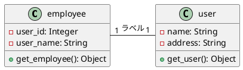
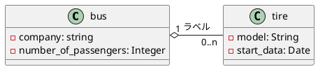
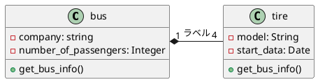
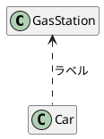
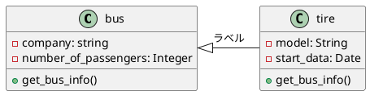
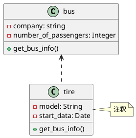
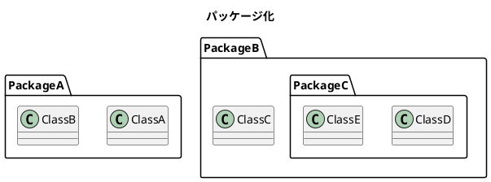
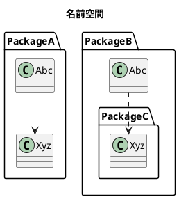

## UML (クラス図)

ちょっとの間離れるとすぐ忘れてしまうので備忘録として。。。

基本的な書き方だけ。

参考

[【UML】クラス図とは | クラス図の書き方と記号](https://medium-company.com/%E3%82%AF%E3%83%A9%E3%82%B9%E5%9B%B3/)

[ PlantUMLでクラス図を作成](https://www.wakuwakubank.com/posts/565-design-uml-class/)

[PlantUML クラス図 早見表](https://qiita.com/kyonc5/items/4d536cb59fd7c41debc1)

感謝！

## 書き方

| 線形	     | 関連                    | 記号         | 	説明                    |
|---------|-----------------------|------------|------------------------|
| 関連      | 関連（association）       | --	        | クラス間の関連を表現             | 
| 集約      | 	集約（aggregation）      | o--	       | クラス間の関連で全体と一部という関係性を表現 | 
| コンポジション | 	コンポジション（composition） | *--        | 	集約よりも強い集約             | 
| 依存      | 	依存（dependency）       | <..	       | クラス間の依存関係を表現           | 
| 汎化      | 	汎化（generalization）   | <&#124;--	 | クラス間の継承を表現             | 
| 実現      | 	実現（realization）      | <..&#124;  | クラス間のインターフェースを表現       | 

```-``` , ```.```  横

```--``` , ```..```  縦

```---``` , ```...```  縦 (遠距離)

---

## 多重度

| 多重度  | 	説明                        |
|------|----------------------------|
| 1    | 	必ず1                       |    
| 0..1 | 	０ または 1                   |    
| 0..＊ | 	0 以上                      |    
| 1..＊ | 	1 以上                      |    
| n..m | 	n以上ｍ以下 ※[例] 1..3 → 1以上3以下 |    
| n    | 	必ずn ※[例] 2 → 必ず2          |    
| n,m	 | nまたはm。[例] 1,3　→　1または3      |    

--- 

## 可視性

| 記号  | 説明              |
|-----|-----------------|
| -   | private         |
| #   | protected       |
| ~   | package private |
| +   | public          |

---

## Example

### 関連（association）

基本的なつながり（関連）をあらわします。

以下の例では「社員クラス」と「ユーザクラス」は関連性があり、クラス間の多重度は1対1であることを表現しています



### 集約（aggregation）

「部分クラス」は「全体クラス」の一部であることをあらわします。ただしお互いに依存関係はない。

以下の例では「乗員クラス」は「バスクラス」の一部であること（お互い依存関係はない）、クラス間の多重度は1対0以上であることを表現しています。



### コンポジション（composition）

「部分クラス」は「全体クラス」の一部であることをあらわします。集約よりも結びつきが強くお互いが存在して成り立つ関係性。

例えば「全体クラス」が削除されると「部分クラス」もあわせて削除されるような関係性をあらわします。

以下の例では「タイヤクラス」は「バスクラス」の一部であり、「バスが廃車になれば、バスについていたタイヤも廃車になる」といった関係性を表現します。（クラス間の多重度は1対4）



### 依存（dependency）

お互いが依存関係にあることを表現します。例えば「クラスA」が変更された時、依存関係にある「クラスB」にも変更が生じるといった関係性をあらわします。

以下の例では、「ホイールクラス」と「タイヤクラス」が依存関係となり、「ホイール」を変えると「タイヤ」も変えるといった関係性を表現しています。（クラス間の多重度は1対4）



### 汎化（generalization）

子クラス」は「親クラス」の性質の継承しているといった関係性をあらわします。

以下の例では「犬クラス」は「動物クラス」の性質を継承していることを表現しています。



### 実現（realization）

「抽象クラス（interface）」の振る舞いを具体的に実装した「クラス」であるといった関係性をあらわします。

以下の例では、抽象的なクラスである「動物クラス」の振る舞いを具体的に実装したものが「犬クラス」であるということを表現しています。



### Package



### Namespaces


