## UML (クラス図)

ちょっとの間離れるとすぐ忘れてしまうので備忘録として。。。

基本的な書き方だけ。

参考

[PlantUMLによるシーケンス図の書き方【メッセージやノートなど】](https://applis.io/posts/plantuml-sequence-diagram)

### メッセージ

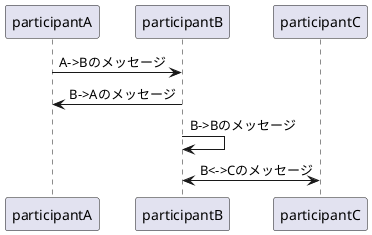

### メッセージの色

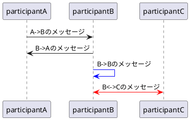

### メッセージの番号

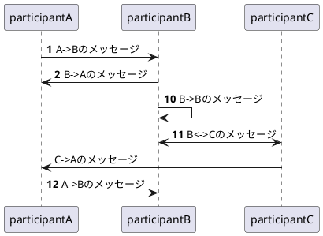

### 分類子の種類

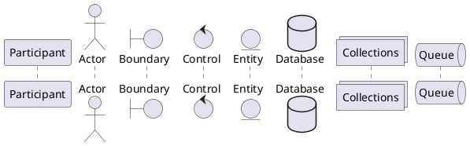

### 分類子の名前

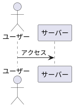

### 分類子の背景色

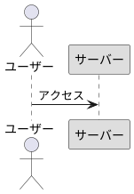

### 分類子のグループ化

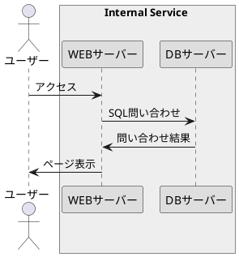

### ノート

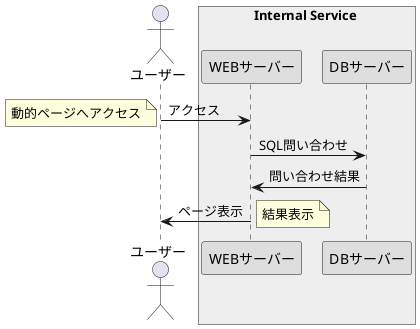

### ノートの背景色

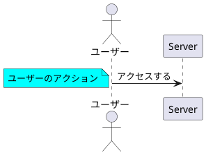

### リファレンスの書き方

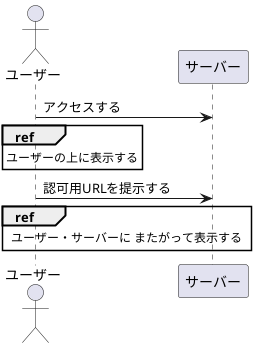

### ライフライン

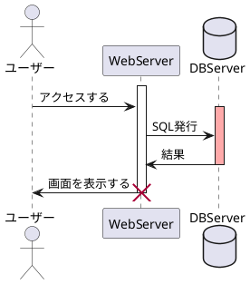

### ショートカット

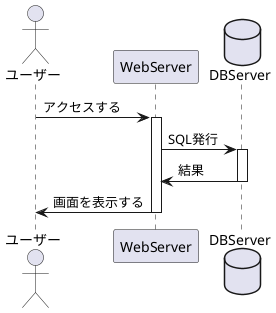

### 区切り線

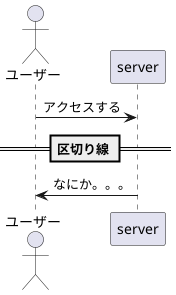

### 遅延

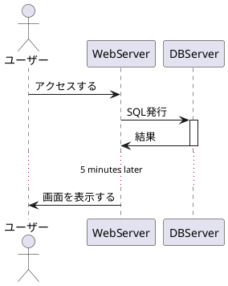

### 文字の装飾

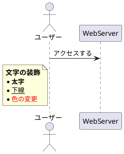

## 改行

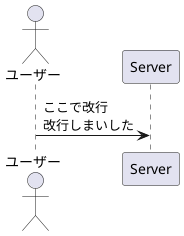
