##  ULM (ステート図) 

ちょっとの間離れるとすぐ忘れてしまうので備忘録として。。。

基本的な書き方だけ。

参考

[State Diagram](https://plantuml.com/state-diagram)


### Simple State

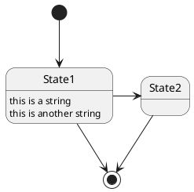

### Change state rendering

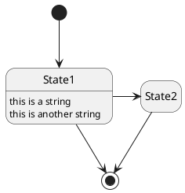

### Composite state

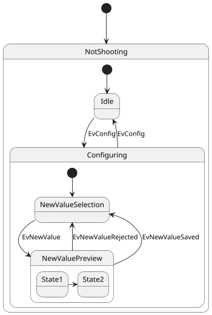

### Sub-state to sub-stat

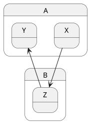

### Long name

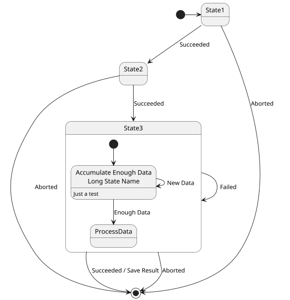

### Fork [fork, join]

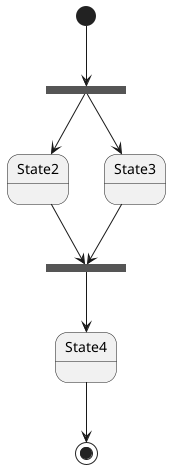

### 同時進行

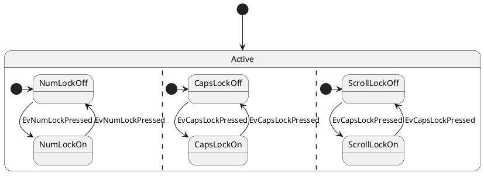

```puml
[*] --> Active

state Active {
  [*] -> NumLockOff
  NumLockOff --> NumLockOn : EvNumLockPressed
  NumLockOn --> NumLockOff : EvNumLockPressed
  --
  [*] -> CapsLockOff
  CapsLockOff --> CapsLockOn : EvCapsLockPressed
  CapsLockOn --> CapsLockOff : EvCapsLockPressed
  --
  [*] -> ScrollLockOff
  ScrollLockOff --> ScrollLockOn : EvCapsLockPressed
  ScrollLockOn --> ScrollLockOff : EvCapsLockPressed
}
```

### 条件

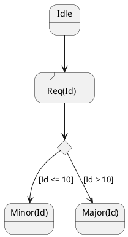

### Arrow directio

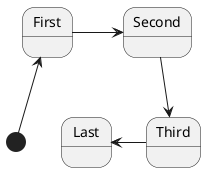

### hange line color and style

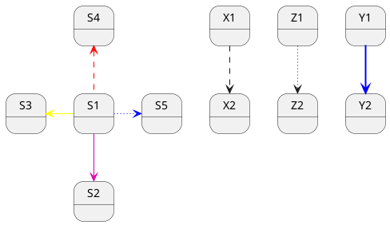
### note

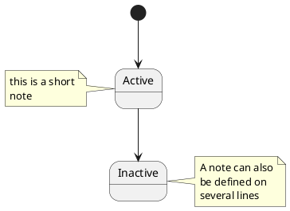

### Inline color

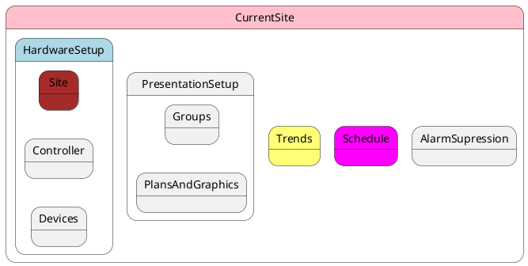

### Skinparam

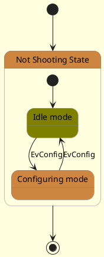

### Test of all specific skinparam to State Diagrams

```puml
@startuml
skinparam State {
  AttributeFontColor blue
  AttributeFontName serif
  AttributeFontSize  9
  AttributeFontStyle italic
  BackgroundColor palegreen
  BorderColor violet
  EndColor gold
  FontColor red
  FontName Sanserif
  FontSize 15
  FontStyle bold
  StartColor silver
}

state A : a a a\na
state B : b b b\nb

[*] -> A  : start
A -> B : a2b
B -> [*] : end
@enduml
```

### Display JSON

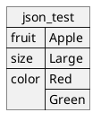
