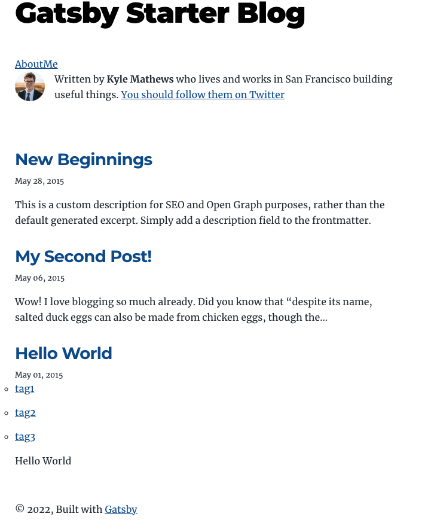
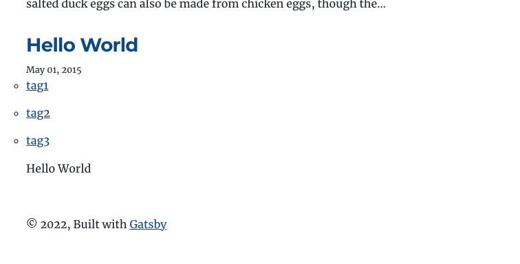
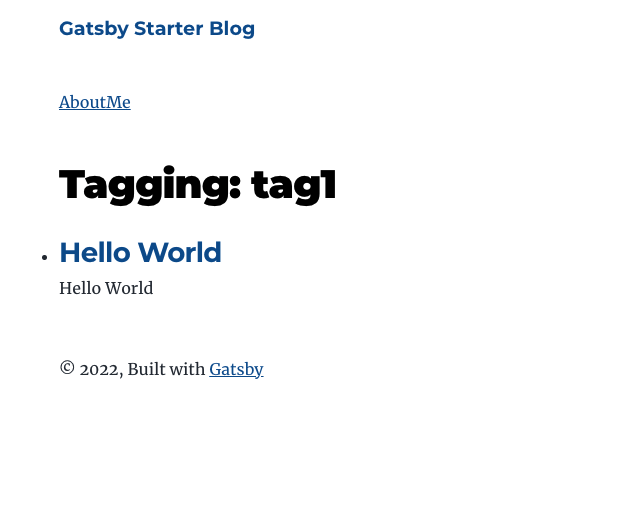

---

title: "GatsbyJS 記事のグループ化"
date: "2022-03-02 20:36:13"
post_modified: "2022-03-02 20:36:13"
description: "GatsbyJS 記事のグループ化。Tagsを実装。Categoryなども同様"
categories: ["FrontEnd"]
tags: ["GatsbyJS", "TypeScript"]
topics: "GatsbyJs"
topic_order: "6"
draft: false

---

## tags 追加

### Frontmatter に tag 追加

```yml
---
title: Hello World
date: "2015-05-01T22:12:03.284Z"
description: "Hello World"
tags: [ "tag1", "tag2", "tag3" ]
---
```

### allMarkdownRemark の node に tags 追加

src/gatsby-node/index.ts

```tsx
// Get all markdown blog posts sorted by date
const result: any = await graphql(
  `
    {
      allMarkdownRemark(sort: { fields: [frontmatter___date], order: ASC }, limit: 1000) {
        nodes {
          id
          fields {
            slug
          }
          frontmatter {
            tags
          }
        }
      }
    }
  `
)
```

### Post 一覧の項目に Tags を追加

#### graphql に tags 追加

src/pages/index.tsx

```tsx
import kebabCase from "lodash/kebabCase"
```

src/pages/index.tsx

```tsx
export const pageQuery = graphql`
  query Index {
    site {
      siteMetadata {
        title
      }
    }
    allMarkdownRemark(sort: { fields: [frontmatter___date], order: DESC }) {
      nodes {
        excerpt
        fields {
          slug
        }
        frontmatter {
          date(formatString: "MMMM DD, YYYY")
          title
          description
          tags
        }
      }
    }
  }
`
```

日付の下辺りに

src/pages/index.tsx

```tsx
<ul className={"tags"}>
  {post?.frontmatter?.tags?.map(tag => {
    return (
      <li key={tag}>
        <Link to={`/tags/${kebabCase(tag)}/`}>{tag}</Link>
      </li>
    )
  })}
</ul>
```



## リンク先がないのでリンク先のページを生成

### template 作成

src/templates/tags.tsx

```tsx
import React from "react"
import Bio from "../components/bio"
import {Link, graphql} from "gatsby"
import Layout from "../components/layout"
import Seo from "../components/seo"

const Tags = ({pageContext, data}: { pageContext: any; data: any }) => {
  const siteTitle = data.site?.siteMetadata?.title || `Title`
  const {tag} = pageContext
  const posts = data.allMarkdownRemark.nodes

  return (
    <Layout location={location} title={siteTitle}>
      <Seo title="All posts"/>
      <Bio/>
      <h1>Tagging: {tag}</h1>
      <ol style={{listStyle: `none`}}>
        {posts.map((post: any) => {
          const title = post.frontmatter?.title || post.fields?.slug

          return (
            <li key={post.fields?.slug}>
              <article className="post-list-item" itemScope itemType="http://schema.org/Article">
                <header>
                  <h2>
                    <Link to={post.fields?.slug || ""} itemProp="url">
                      <span itemProp="headline">{title}</span>
                    </Link>
                  </h2>
                  <small>{post.frontmatter?.date || ""}</small>
                </header>
                <section>
                  <p
                    dangerouslySetInnerHTML={{
                      __html: post.frontmatter?.description || post?.excerpt || "",
                    }}
                    itemProp="description"
                  />
                </section>
              </article>
            </li>
          )
        })}
      </ol>
    </Layout>
  )
}
export default Tags

export const pageQuery = graphql`
  query Tags($tag: String) {
    site {
      siteMetadata {
        title
      }
    }
    allMarkdownRemark(
      sort: { fields: [frontmatter___date], order: DESC }
      filter: { frontmatter: { tags: { in: [$tag] } } }
    ) {
      totalCount
      nodes {
        fields {
          slug
        }
        frontmatter {
          date(formatString: "MMMM DD, YYYY")
          title
          description
          tags
        }
      }
    }
  }
`
```

### page 生成

src/gatsby-node/index.ts

```tsx
const _ = require("lodash")


export const createPages: GatsbyNode["createPages"] = async ({graphql, actions, reporter}) => {
...
...
  ここに下記を追加
...
...
}
```

src/gatsby-node/index.ts

```tsx
////////////////////////////////////////////////
///  Tags
////////////////////////////////////////////////
// console.log(posts)
let tags = posts.reduce((tags: any, node: any) => {
  const nodesTags: any = node?.frontmatter?.tags
  return nodesTags ? tags.concat(nodesTags) : tags
}, [])
// 重複削除
tags = [...new Set(tags)]
console.log(tags)

const tagTemplate = path.resolve("src/templates/tags.tsx")

tags.forEach((item: any) => {
  const tag = item
  const prefix = `/tags/${_.kebabCase(tag)}/`
  createPage({
    path: prefix,
    component: tagTemplate,
    context: {
      tag: tag,
    },
  })
})
```



tag のリンクをクリック



このページにも`index.tsx`のように各 Post のタグを表示する。  
ページは`src/pages/index.tsx`,`templates/tags.tsx` と別なのだがやることは同じなので component 化する。

`src/pages/index.tsx`に追記した下記を

```tsx
<ul className={"tags"}>
  {post?.frontmatter?.tags?.map(tag => {
    return (
      <li key={tag}>
        <Link to={`/tags/${kebabCase(tag)}/`}>{tag}</Link>
      </li>
    )
  })}
</ul>
```

`src/compnents/tagsInlist.tsx` にコピー

src/compnents/tagsInlist.tsx

```tsx
import * as React from "react"
import {Link} from "gatsby"
import kebabCase from "lodash/kebabCase"
import styled from "styled-components"

const TagsInList = ({tags}: { tags: any }) => {
  return (
    <UlWrapper className={"tags"}>
      {tags?.map((tag: string) => {
        return (
          <li key={tag}>
            <Link to={`/tags/${kebabCase(tag)}/`}>{tag}</Link>
          </li>
        )
      })}
    </UlWrapper>
  )
}

export default TagsInList
```

### src/templates/tags.tsx を編集

- import component
- component 配置
- component へ tags を props

を追加

```tsx
import React from "react"
import Bio from "../components/bio"
import {Link, graphql} from "gatsby"
import Layout from "../components/layout"
import Seo from "../components/seo"
import TagsInList from "../components/tagsInList"

const Tags = ({pageContext, data}: { pageContext: any; data: any }) => {
  const siteTitle = data.site?.siteMetadata?.title || `Title`
  const {tag} = pageContext
  const posts = data.allMarkdownRemark.nodes

  return (
    <Layout location={location} title={siteTitle}>
      <Seo title="All posts"/>
      <Bio/>
      <h1>Tagging: {tag}</h1>
      <ol style={{listStyle: `none`}}>
        {posts.map((post: any) => {
          const title = post.frontmatter?.title || post.fields?.slug
          const tags = post.frontmatter?.tags

          return (
            <li key={post.fields?.slug}>
              <article className="post-list-item" itemScope itemType="http://schema.org/Article">
                <header>
                  <h2>
                    <Link to={post.fields?.slug || ""} itemProp="url">
                      <span itemProp="headline">{title}</span>
                    </Link>
                  </h2>
                  <small>{post.frontmatter?.date || ""}</small>
                </header>
                <TagsInList tags={tags}/>
                <section>
                  <p
                    dangerouslySetInnerHTML={{
                      __html: post.frontmatter?.description || post?.excerpt || "",
                    }}
                    itemProp="description"
                  />
                </section>
              </article>
            </li>
          )
        })}
      </ol>
    </Layout>
  )
}
export default Tags

export const pageQuery = graphql`
  query Tags($tag: String) {
    site {
      siteMetadata {
        title
      }
    }
    allMarkdownRemark(
      sort: { fields: [frontmatter___date], order: DESC }
      filter: { frontmatter: { tags: { in: [$tag] } } }
    ) {
      totalCount
      nodes {
        fields {
          slug
        }
        frontmatter {
          date(formatString: "MMMM DD, YYYY")
          title
          description
          tags
        }
      }
    }
  }
`
```

### component を インポート

src/pages/index.tsx

```tsx
import TagsInList from "../components/tagsInList"

.....
.....
.....
<TagsInList tags={post?.frontmatter?.tags}/>
.....
.....
.....
```

src/templates/tags.tsx

```tsx
import TagsInList from "../components/tagsInList"

.....
.....
.....
<TagsInList tags={node?.frontmatter?.tags}/>
.....
.....
.....
```


