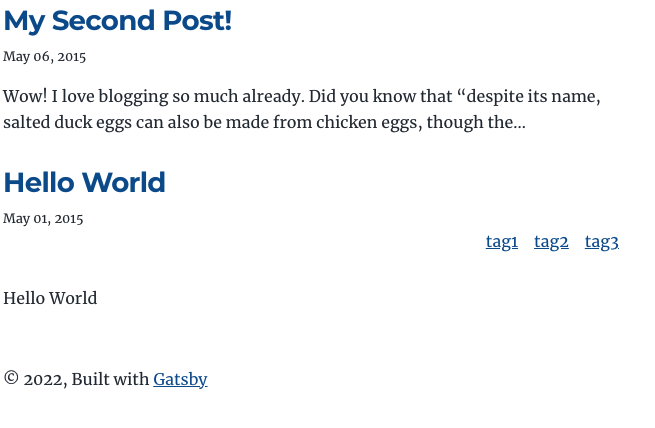

---

title: "GatsbyJS styled-components でスタイリング"
date: "2022-03-02 20:37:56"
post_modified: "2022-03-02 20:37:56"
description: "GatsbyJS styled-components を導入し CSS を反映する。"
categories: ["FrontEnd"]
tags: ["GatsbyJS", "TypeScript"]
topics: "GatsbyJS"
topic_order: "7"
draft: false

---

## tags 表示の component に style をあてる


## Install styled-components を使う

```bash
yarn add gatsby-plugin-styled-components styled-components babel-plugin-styled-components
yarn add @types/styled-components
```

## プラグインを有効にする

gatsby-config.js

```tsx
...
...
...
`gatsby-plugin-styled-components`
...
...
```

## スタイルを実装する

src/components/tagsInList.tsx

```tsx
import * as React from "react"
import {Link} from "gatsby"
import kebabCase from "lodash/kebabCase"
import styled from "styled-components"

const TagsInList = ({tags}) => {
  return (
    <UlWrapper className={"tags"}>
      {tags?.map(tag => {
        return (
          <li key={tag}>
            <Link to={`/tags/${kebabCase(tag)}/`}>{tag}</Link>
          </li>
        )
      })}
    </UlWrapper>
  )
}

export default TagsInList

const UlWrapper = styled.ul`
  list-style: none;
  display: flex;
  flex-wrap: wrap;
  -webkit-justify-content: flex-end;
  justify-content: flex-end;
  li {
    margin-right: 1em;
  }
`
```

/index


/tags

