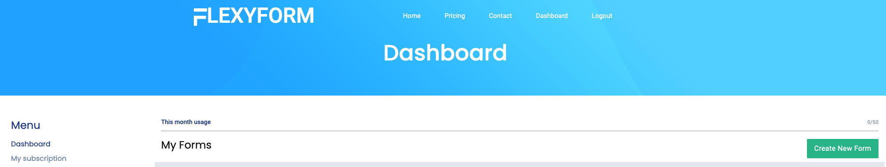

---

title: "GatsbyJS 問い合わせフォームを設置"
date: "2022-03-02 20:42:03"
post_modified: "2022-03-02 20:42:03"
description: "GatsbyJS 問い合わせフォームを実装 Netlify, FlexyForm"
categories: ["FrontEnd"]
tags: ["GatsbyJS", "TypeScript"]
topics: "GatsbyJs"
topic_order: "9"
draft: false

---


GatsbyJS をはじめとする JavaScript 製のアプリだけでは(node.js などサーバーサイドは別)メールフォームの実装はできない。(するべきではない)

## GatsbyJS のみでメールフォームを実装しない理由

- コード内にメール送信のための認証情報を書く必要があり情報漏えいになる。
- 迷惑メールの対象になる。

## GatsbyJS メールフォームを実装する方法

ネットでググれば [Netlify](https://www.netlify.com) の情報が多く引っかかる。

ざっくり、[Netlify](https://www.netlify.com) とは静的サイトのホスティングサービスでもちろん **_GatsbyJS_** を Deploy できる。 メールフォームも実装できる。

1. [Netlify](https://www.netlify.com) のお作法に従いメールフォームを生成 (2~3 行をコードに含める)
1. [Netlify](https://www.netlify.com) で Build
1. Build 時に [Netlify](https://www.netlify.com) がメールフォームを有効にしてくれる。

[Netlify](https://www.netlify.com) の無料枠は 50(submit)/1(month)

## GatsbyJS で Netrify のメールフォームを実装するデメリット

メールフォームが [Netlify](https://www.netlify.com) に最適化されるためホスティングは [Netlify](https://www.netlify.com) 以外使えない

## GatsbyJS で Netrify 以外のメールフォームを検証する

[FlexyForm](https://www.flexyform.com) 一度でいいように思える。

## GatsbyJS で FlexyForm でメールフォームを実装するメリット

- [Netlify](https://www.netlify.com) のように手軽にフォームを構築できる (2~3 行をコードに含める)
- ホスティング先を選ばない。[Netlify](https://www.netlify.com)
  でも [GitHub page](https://docs.github.com/ja/pages/getting-started-with-github-pages/about-github-pages) でも可能

[Netlify](https://www.netlify.com) の無料枠は 50(submit)/1(month) と [Netlify](https://www.netlify.com) 同等

## GatsbyJS でメールフォームを FlexForm で実装

アカウント作成は省きます。

[FlexyForm Dashbord](https://www.flexyform.com/dashboard)



`Create new Foem` 押下


- name: 適当に
- Url: 問い合わせフォームの URL
- Return url: いわゆるサンクスページ
- Forward email: メールの転送先

メールフォーム作成後 緑のアイコン `view sample code`を押下

```html

<form method="post" action="https://www.flexyform.com/f/YOUR_CODE">
    <p>
        <label>Fullname</label>
        <input type="text" name="fullname"/>
    </p>
    <p>
        <label>Email</label>
        <input type="email" name="_reply_to"/>
    </p>
    <button type="submit">Send</button>
</form>
```

これをもとに必要な項目を書いていく。

- 件名
- 本文
- お名前

などなど

```html
<input type="hidden" name="_empty_field"/>
```

を追加すると迷惑メール防止になるとかならないとか。。。

青いアイコン `view submitions` を押下すればといあわせないようを確認できる
