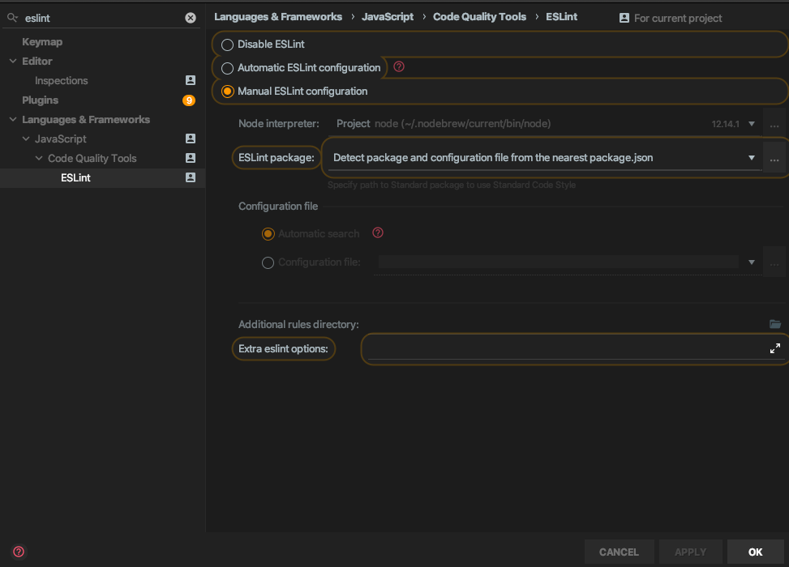
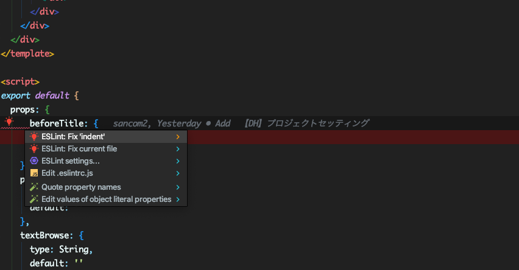

# Eslint (vue) - Laravelでの開発の前準備3

# Eslint

## Install

``` bash
$ npm install babel-eslint eslint eslint-config-prettier eslint-config-standard eslint-friendly-formatter eslint-loader eslint-plugin-html eslint-plugin-import eslint-plugin-jsx-a11y eslint-plugin-node eslint-plugin-prettier eslint-plugin-promise eslint-plugin-standard eslint-plugin-vue laravel-mix-eslint --save-dev
```

### package.jsonへScriptとして登録

vim composer.json
npm run eslint でrule違反箇所を確認
npm run eslint-fix でrule違反箇所を整形

``` bash
    "scripts": {
    ...
    ...
    ...
     +   "eslint": "eslint ./resources/js/*/*/*.vue ./resources/js/*.js ./resources/js/*/*.vue ",
     +   "eslint-fix": "eslint ./resources/js/*/*/*.vue ./resources/js/*.js ./resources/js/*/*.vue --fix",
    },
```

### IDEへの設定

例) Intelij idea

Preferences \| Languages & Frameworks \| JavaScript \| Code Quality Tools \| ESLint



ルール違反箇所



[option]{.kbd} + [CR]{.kbd}
で自動整形

## 設定ファイル

プロジェクトルートへ.eslintrc.js

``` javascript
module.exports = {
    root: true,
    globals: {
        '_': true, // lodash
        'Enumerable': true, // linq
        Vue: true
    },
    parserOptions: {
        parser: 'babel-eslint'
    },
    env: {
        'browser': true,
        'jquery' : true,
        "mocha": true
    },
    extends: [
        "prettier",
        'standard', // https://github.com/standard/standard/blob/master/docs/RULES-en.md,
        'eslint:recommended',
        // "plugin:vue-i18n/recommended",
        // 'plugin:vue/essential'
        // "plugin:vue/strongly-recommended"
        'plugin:vue/recommended'

    ],
    // required to lint *.vue files
    plugins: [
        'vue',
        "prettier"
    ],
    // add your custom rules here
    rules: {
        // allow async-await
        'generator-star-spacing': 'off',
        "indent": ["error", 2],
        "object-shorthand": [0,"always"]

    },
}
```
