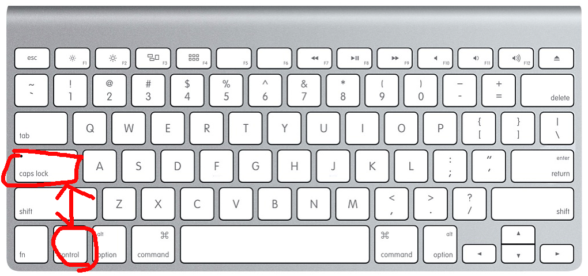

# Karabiner

特に MAC では US キーボードか JIS キーボードかと宗教戦争みたいなこともありますがどちらもメリット、デメリットあります。

US キーボードでも JIS キーボードでもどちらのデメリットを補ってくれるキーボードをカスタマイズできるアプリです。
[Karabiner](https://pqrs.org/osx/karabiner/)

## Karabinerc で自分だけのショートカット

以下 US キーボード前提での例です。僕の例です。

- [delet]{.kbd} + [e]{.kbd} Excel
- [delet]{.kbd} + [z]{.kbd} Finder
- [fn]{.kbd} + [j]{.kbd} Intellij idea
- [fn]{.kbd} + [p]{.kbd} Adobe Photoshop
  などなど。。。

US キーボードでは

- [delete]{.kbd}、は右上
- [fn]{.kbd}、は左下

にあります。

ホームポッションを崩さずにアプリを一瞬でスイッチングできます。
他のアルファベットや数字キーによく使うアプリを設定しています。

正直、[cmd]{.kbd} + [tab]{.kbd} のスイッチングは[tab]{.kbd}の連打が[めんどくさい]{.under_line}。
[cmd]{.kbd} + [tab]{.kbd} より遥かに楽で早いです。

## Karabiner でキー押下時をカスタマイズ。

以下、[caps lock]{.kbd}と[left control]{.kbd}を入れ替えた設定を前提にしてます。
これは MAC の設定画面でもできますが Karabiner でももちろんできます。

Karabiner での設定

### どんなことができるのか

- [space]{.kbd}長押しで[shift]{.kbd}
- [left control]{.kbd}にトレードオフした[caps lock]{.kbd}単体押し(長押しでない)で[esc]{.kbd} [英数を送信]{.kbd}
- [enter]{.kbd} 長押しで [control]{.kbd}
- More\...

特に**Vim**を使う時には有効な設定です。

個人的には

- [caps lock]{.kbd}にトレードオフした[letf control]{.kbd} + [h]{.kbd} でカーソル左移動

そういうことです。
[j]{.kbd},[k]{.kbd},[l]{.kbd}も割り当てます。個人的にはこれはすごく便利です。
マウスやカーソルキーを使うのは[めんどくさい]{.under_line}のでなるべくホームポジションを崩したくないんです。

## Karabiner のデメリット

**Karabiner**無しでは仕事が捗らなくなるという中毒性があります。
他人の MAC を操作すると Typo 連発です。

キーバードでマウスを動かす設定もできます。マウスのスピードも調整できます。
[d]{.kbd} + ([h]{.kbd} or [j]{.kbd} or [k]{.kbd} or [l]{.kbd})

でも僕はこの設定は外しました。
'sudo' と早くタイプするとなぜか 'suod' になってしまうのです。
ゆっくり打てばいいのですがそれは[めんどくさい]{.under_line}ので一旦外してます。
キーボード上でマウス操作できるは魅力なので通常のタイプに問題がでない設定を考えてみようと思います。
今後の課題とします。
