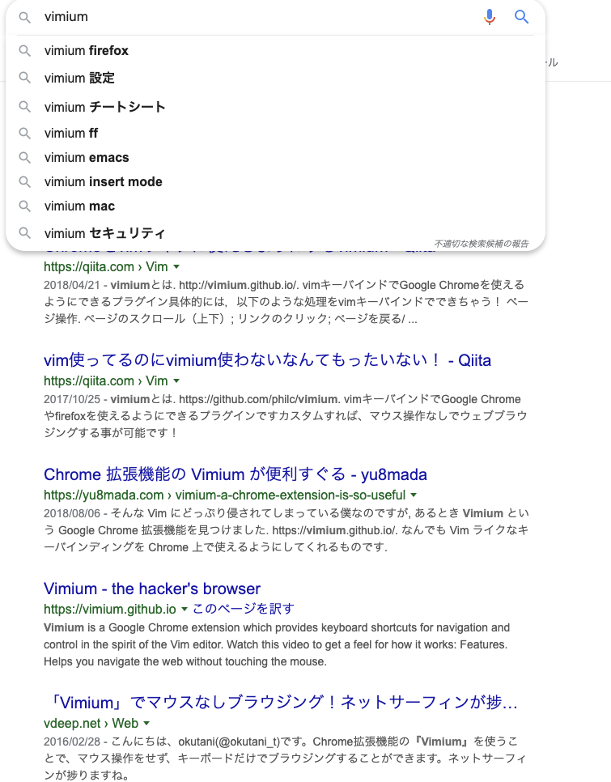

# Chrome アドオン Vimium

## VImium が便利すぎ

ブラウジング時に戻ったり、進んだり、上スクロールしたり、下スクロールしたり、フォーム入力だったり・・・
マウスやトラックパッドでガチャガチャやるのが[めんどくさい]{.under_line}時は[Vimium](https://chrome.google.com/webstore/detail/vimium/dbepggeogbaibhgnhhndojpepiihcmeb?hl=ja)の出番です。

- [k]{.kbd}　上スクロール
- [j]{.kbd}　下スクロール
- [h]{.kbd}　戻る
- [l]{.kbd}　進む
- [f]{.kbd}　リンクを開く、[Shit]{.kbd} + [f]{.kbd}だと新規タブで開く
- [g]{.kbd} [i]{.kbd} テキストボックスをアクティブ

And more\...

例えば


という表示で [f]{.kbd} をタイプ


ということです。

[g]{.kbd} [i]{.kbd} とタイプすると



テキストボックスにカーソルが移動。

カスタマイズもできます。
僕はこのような設定にしてます。

```bash
# Insert your preferred key mappings here.
map h goBack
map l goForward
map H scrollLeft
map L scrollRight
map , previousTab
map . nextTab
map j scrollDown count=1
map k scrollUp count=1
map <c-f> scrollPageDown count=2
map <c-b> scrollPageUp count=2
map w removeTab
map T restoreTab
```

```bash
map <c-f> scrollPageDown count=2
map <c-b> scrollPageUp count=2
```

[ctl]{.kbd}+[f]{.kbd} ページダウン
[ctl]{.kbd}+[b]{.kbd} ページアップ

がとても Vim ぽくて素敵です。

マウスいらずで効率アップ！
