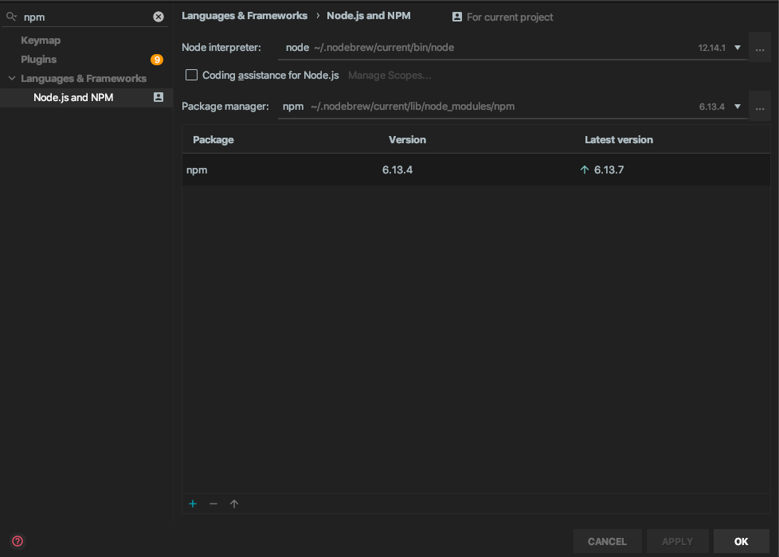
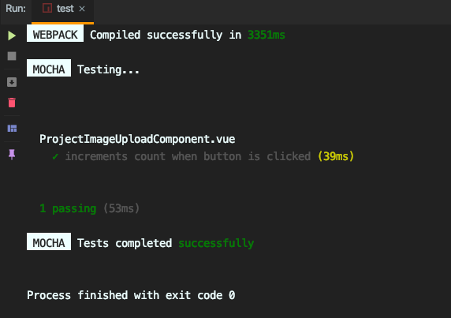

# vue.js テスト環境 - Laravel での開発の前準備 5

## Vue.js Unittest を導入する

### vue test-utils install

```bash
npm install --save-dev @vue/test-utils mocha jsdom jsdom-global expect
```

しかしこれではうまく動かない。

```bash
Error: Chunk.parents: Use ChunkGroup.getParents() instead
```

package.json を変更

```bash
 "mocha-webpack": "^2.0.0-beta.0",
```

再度

```bash
npm install
```

## vue.js テストを設置

javascript のテスト用ディレクトリを作成

```bash
mkdir tests/Javascript
```

test 用 setup.js 作成(公式に準ずる)

```bash
vim tests/Javascript/setup.js
```

tests/Javascript/setup.js

```bash
require('jsdom-global')()

global.expect = require('expect')
```

## testunit を作る

### testunit (テストする方)

tests/Javascript/VueTestComponent.spec.js

```bash
import { shallowMount } from '@vue/test-utils'
import ProjectImageUploadComponent from '../../resources/js/components/VueTestComponent.vue'

describe('VueTestComponent.vue', () => {
  it('props test', () => {
    const wrapper = shallowMount(VueTestComponent)
    const paramName = 'vuetest'
    wrapper.setProps({
      TestParam: paramName
    })
    // eslint-disable-next-line no-undef
    expect(wrapper.vm.$props.paramName).toBe(paramName)
  })
})
```

### vue component (テストされる方)

../../resources/js/components/VueTestComponent.vue

```bash
<template>
  <div> {{ testParam: }}</div>
</template>

<script>
export default {
  props: {
    testParam: {
      type: String,
      default: ''
    },
  },

}
</script>
```

## packege.json に script 登録

```bash
npm run test
```

で実行できるようにする

package.json

```bash
    "scripts": {
        ...
        ...
        ...
        ...
        "test": "mocha-webpack --webpack-config=node_modules/laravel-mix/setup/webpack.config.js --require tests/Javascript/setup.js tests/Javascript/**/*.spec.js"
    },
```

## vue unittest を実行

```bash
npm test
```

このような結果だと成功

```bash
 WEBPACK  Compiled successfully in 3370ms

 MOCHA  Testing...

  ProjectImageUploadComponent.vue
    ✓ increments count when button is clicked (64ms)

  1 passing (210ms)

 MOCHA  Tests completed successfully
```

## IDE から test 実行

例 Intellij idea
Preferences \| Languages & Frameworks \| Node.js and NPM



[optin]{.kbd} + [F11]{.kbd}
で npm script を Popup 表示


test を選択して実行



test 成功
